Ingeniería del Conocimiento (TIC-1015)
Investigación Individual
Título de la investigación
Inteligencia de negocios y su relacion con la ingenieria del conocimuiento

Estudiante
Nombre completo:
Tome Salazar Karen Jocelyn 

Docente
Rene Solis Reyes 

Asignatura
Ingeniería del Conocimiento (TIC-1015)

Institución
Tecnológico Nacional de México

1. Introducción
En la actualidad, las organizaciones manejan grandes cantidades de datos generados por sistemas informáticos, transacciones comerciales y procesos internos. Sin embargo, disponer de datos no garantiza una buena toma de decisiones. Por esta razón, surge la Inteligencia de Negocios (Business Intelligence, BI) como una disciplina orientada a transformar los datos en información útil y comprensible para apoyar decisiones estratégicas.
la Ingeniería del Conocimiento se encarga de capturar, estructurar y representar el conocimiento humano dentro de sistemas computacionales, permitiendo que estos puedan razonar y apoyar la resolución de problemas complejos. Ambas áreas se encuentran estrechamente relacionadas, ya que la Inteligencia de Negocios genera información valiosa que puede convertirse en conocimiento mediante técnicas propias de la Ingeniería del Conocimiento.

2. Objetivo
Objetivo general
Analizar la Inteligencia de Negocios y su relación con la Ingeniería del Conocimiento, identificando sus principales características, aplicaciones y su impacto en la toma de decisiones dentro de los sistemas computacionales.

4. Marco teórico
   
3.1 Inteligencia de Negocios

La Inteligencia de Negocios se define como un conjunto de metodologías, procesos y herramientas tecnológicas que permiten recopilar, analizar y presentar información para apoyar la toma de decisiones empresariales (Turban, Sharda & Delen, 2011). Su principal objetivo es transformar los datos en información significativa que ayude a mejorar el desempeño organizacional.

Entre los principales componentes de la Inteligencia de Negocios se encuentran los sistemas de Data Warehouse, los procesos ETL, las herramientas OLAP y la minería de datos, los cuales permiten analizar grandes volúmenes de información de manera eficiente (Laudon & Laudon, 2016).

3.2 Ingeniería del Conocimiento

La Ingeniería del Conocimiento es una disciplina de la Inteligencia Artificial que se enfoca en la adquisición, representación y utilización del conocimiento dentro de sistemas computacionales (Studer, Benjamins & Fensel, 1998). Su objetivo es capturar el conocimiento experto y estructurarlo de forma que pueda ser procesado por una máquina.

Los principales procesos de la Ingeniería del Conocimiento incluyen la adquisición del conocimiento, su representación mediante reglas u ontologías, el razonamiento automático y el mantenimiento del conocimiento a lo largo del tiempo.

3.3 Relación entre Inteligencia de Negocios e Ingeniería del Conocimiento

La relación entre ambas disciplinas se basa en que la Inteligencia de Negocios se centra en el análisis de datos, mientras que la Ingeniería del Conocimiento permite convertir esa información en conocimiento formal y reutilizable. De esta forma, la BI aporta la información necesaria y la Ingeniería del Conocimiento se encarga de estructurarla y aplicarla en sistemas inteligentes

Desarrollo
La Inteligencia de Negocios y la Ingeniería del Conocimiento trabajan de manera complementaria dentro de las organizaciones modernas. Mientras la BI permite identificar patrones, tendencias y comportamientos a partir de los datos, la Ingeniería del Conocimiento transforma esos resultados en reglas, modelos o recomendaciones automatizadas.
Ejemplo aplicado

En una empresa comercial, la Inteligencia de Negocios puede identificar que ciertos productos se venden más en determinadas temporadas. A partir de esta información, la Ingeniería del Conocimiento puede generar reglas que permitan recomendar productos automáticamente o ajustar los niveles de inventario.

Caso de uso

Un sistema de apoyo a la toma de decisiones puede integrar dashboards de BI con un sistema basado en conocimiento, permitiendo no solo analizar datos, sino también sugerir acciones estratégicas basadas en reglas previamente definidas.

Análisis y discusión
Entre las principales ventajas de integrar la Inteligencia de Negocios con la Ingeniería del Conocimiento se encuentra la mejora en la calidad de las decisiones, ya que se pasa de un análisis descriptivo a un razonamiento más avanzado. Además, se logra una mejor reutilización del conocimiento organizacional.

No obstante, esta integración también presenta limitaciones, como la dificultad para adquirir conocimiento experto y la dependencia de la calidad de los datos. Asimismo, su implementación puede implicar costos elevados en infraestructura y capacitación.

En aplicaciones reales, esta relación tiene un impacto significativo en áreas como la gestión empresarial, el análisis financiero y los sistemas de recomendación, donde los sistemas computacionales juegan un papel clave en la toma de decisiones.

```mermaid
flowchart TD

A["Ingeniería del Conocimiento (TIC-1015)"]
A --> B["Investigación Individual"]
B --> C["Inteligencia de Negocios y su relación con la Ingeniería del Conocimiento"]

C --> D["Estudiante: Tome Salazar Karen Jocelyn"]
C --> E["Docente: Rene Solis Reyes"]
C --> F["Institución: Tecnológico Nacional de México"]

C --> G["1. Introducción"]
G --> G1["Organizaciones manejan grandes volúmenes de datos"]
G --> G2["BI transforma datos en información útil"]
G --> G3["Ingeniería del Conocimiento convierte información en conocimiento"]

C --> H["2. Objetivo"]
H --> H1["Analizar BI y su relación con Ingeniería del Conocimiento"]
H --> H2["Identificar características, aplicaciones e impacto"]

C --> I["3. Marco Teórico"]

I --> I1["3.1 Inteligencia de Negocios"]
I1 --> I11["Data Warehouse"]
I1 --> I12["Procesos ETL"]
I1 --> I13["OLAP"]
I1 --> I14["Minería de Datos"]
I1 --> I15["Apoya toma de decisiones"]

I --> I2["3.2 Ingeniería del Conocimiento"]
I2 --> I21["Adquisición del conocimiento"]
I2 --> I22["Representación (reglas / ontologías)"]
I2 --> I23["Razonamiento automático"]
I2 --> I24["Mantenimiento del conocimiento"]

I --> I3["3.3 Relación entre ambas"]
I3 --> I31["BI analiza datos"]
I3 --> I32["Ingeniería del Conocimiento estructura información"]
I3 --> I33["Integración en sistemas inteligentes"]

C --> J["Desarrollo"]
J --> J1["BI identifica patrones y tendencias"]
J --> J2["Ingeniería del Conocimiento crea reglas y modelos"]
J --> J3["Ejemplo: Recomendación automática de productos"]
J --> J4["Caso de uso: Sistema de apoyo a decisiones"]

C --> K["Análisis y Discusión"]
K --> K1["Mejora calidad de decisiones"]
K --> K2["Reutilización del conocimiento"]
K --> K3["Limitaciones: calidad de datos"]
K --> K4["Costos e infraestructura"]

C --> L["Ventajas"]
L --> L1["Mejor toma de decisiones"]
L --> L2["Automatización del conocimiento"]
L --> L3["Gestión del conocimiento organizacional"]

C --> M["Limitaciones"]
M --> M1["Dependencia de calidad de datos"]
M --> M2["Complejidad en adquisición del conocimiento"]
M --> M3["Mantenimiento continuo"]

C --> N["Conclusiones"]
N --> N1["BI transforma datos en información"]
N --> N2["Ingeniería del Conocimiento convierte información en conocimiento"]
N --> N3["Fortalece sistemas inteligentes"]

C --> O["Referencias"]
O --> O1["Laudon & Laudon (2016)"]
O --> O2["Studer, Benjamins & Fensel (1998)"]
O --> O3["Turban, Sharda & Delen (2011)"]
O --> O4["IBM Business Intelligence Documentation"]

C --> P["Declaración de originalidad"]
P --> P1["Autora: Karen Jocelyn Tome Salazar"]
P --> P2["Fecha: 10/02/2026"]

```

Ventajas y limitaciones
Ventajas

Una de las principales ventajas de la Inteligencia de Negocios en relación con la Ingeniería del Conocimiento es la mejora en la toma de decisiones, ya que permite transformar grandes volúmenes de datos en información comprensible y, posteriormente, en conocimiento útil para las organizaciones. Esto facilita la identificación de patrones, tendencias y oportunidades de mejora.

Otra ventaja importante es la automatización del conocimiento, ya que mediante técnicas de la Ingeniería del Conocimiento es posible representar reglas, modelos u ontologías que permiten a los sistemas computacionales razonar y generar recomendaciones sin intervención constante del usuario. Esto incrementa la eficiencia operativa y reduce errores humanos.

Además, la integración de ambas disciplinas favorece una mejor gestión del conocimiento organizacional, permitiendo reutilizar experiencias y aprendizajes previos, lo cual contribuye a la innovación y al fortalecimiento de la ventaja competitiva de las organizaciones.

Limitaciones

Entre las principales limitaciones se encuentra la dependencia de la calidad de los datos, ya que resultados incorrectos o incompletos pueden generar conclusiones erróneas y afectar negativamente la toma de decisiones. Sin datos confiables, la Inteligencia de Negocios pierde efectividad.

Otra limitación relevante es la complejidad en la adquisición y representación del conocimiento, dado que capturar el conocimiento experto y formalizarlo en reglas o modelos puede ser un proceso largo y costoso. Además, el conocimiento puede cambiar con el tiempo, lo que requiere mantenimiento continuo.

6. Conclusiones
La Inteligencia de Negocios y la Ingeniería del Conocimiento mantienen una relación directa y complementaria dentro de los sistemas computacionales modernos. La BI permite transformar datos en información relevante, mientras que la Ingeniería del Conocimiento convierte esa información en conocimiento estructurado que puede ser utilizado por sistemas inteligentes. Esta integración fortalece la toma de decisiones, optimiza el uso de la información y contribuye al desarrollo de soluciones tecnológicas más eficientes.

8. Aporte al repositorio
Este trabajo aporta una visión clara sobre la relación entre la Inteligencia de Negocios y la Ingeniería del Conocimiento, sirviendo como material de apoyo para estudiantes y futuros cursos relacionados con análisis de datos, sistemas inteligentes y gestión del conocimiento.

8. Referencias
Laudon, K. C., & Laudon, J. P. (2016). Management Information Systems. Pearson.

Studer, R., Benjamins, V. R., & Fensel, D. (1998). Knowledge engineering: Principles and methods. Data & Knowledge Engineering, 25(1–2), 161–197.

Turban, E., Sharda, R., & Delen, D. (2011). Decision Support and Business Intelligence Systems. Pearson.

IBM. (s.f.). Business Intelligence documentation. Sitio web oficial de IBM.

9. Declaración de originalidad
Declaro que esta investigación es de autoría propia y que las fuentes utilizadas han sido debidamente citadas.

Firma:
KAREN JOCELYN TOME SALAZAR

Fecha:
10/02/2026
