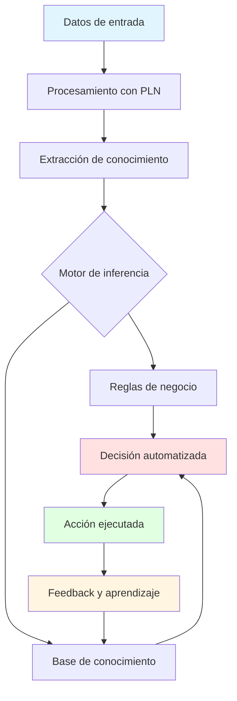

# Ingeniería del Conocimiento (TIC-1015)
## Investigación Individual

### Título de la investigación
**Aplicaciones actuales de la Ingeniería del Conocimiento en organizaciones**

---

### Estudiante
**Nombre completo:**  
Ramon Eduardo Contreras Barajas

### Docente
Dr. Rene Solis Reyes

### Asignatura
Ingeniería del Conocimiento (TIC-1015)

### Institución
Tecnológico Nacional de México - Campus Tijuana

---

## 1. Introducción

La Ingeniería del Conocimiento (IC) se ha consolidado como una disciplina fundamental en la era de la transformación digital, permitiendo a las organizaciones capturar, estructurar y utilizar el conocimiento organizacional de manera estratégica. En un entorno empresarial cada vez más competitivo y dinámico, la capacidad de gestionar efectivamente el conocimiento se ha convertido en un diferenciador clave para la innovación y la ventaja competitiva.

Las aplicaciones actuales de la IC en organizaciones van más allá de los sistemas expertos tradicionales, incorporando tecnologías emergentes como inteligencia artificial, aprendizaje automático, procesamiento de lenguaje natural y analítica avanzada. Estas herramientas están transformando procesos de toma de decisiones, optimización operacional, gestión de recursos humanos y experiencia del cliente.

El presente trabajo explora las principales aplicaciones de la Ingeniería del Conocimiento en contextos organizacionales contemporáneos, analizando casos concretos y evaluando su impacto en diferentes sectores industriales. Se busca comprender cómo las organizaciones están aprovechando los principios y técnicas de la IC para crear valor, mejorar la eficiencia y fomentar la innovación continua.

---

## 2. Objetivo

### Objetivo general

Analizar y documentar las aplicaciones actuales de la Ingeniería del Conocimiento en organizaciones modernas, identificando sus metodologías, tecnologías habilitadoras, casos de uso representativos y el impacto generado en la eficiencia operacional y la toma de decisiones estratégicas.

---

## 3. Marco teórico

### 3.1 Definición de Ingeniería del Conocimiento

La Ingeniería del Conocimiento es una disciplina de la inteligencia artificial que se enfoca en el diseño, desarrollo e implementación de sistemas basados en conocimiento. Según Studer et al. (1998), implica la integración de conocimiento en sistemas computacionales para resolver problemas complejos que tradicionalmente requerían experiencia humana especializada.

### 3.2 Componentes fundamentales

**Gestión del Conocimiento Organizacional:**  
Proceso sistemático de identificar, capturar, compartir y utilizar el conocimiento colectivo de una organización para mejorar el desempeño y crear valor (Nonaka & Takeuchi, 1995).

**Sistemas Basados en Conocimiento:**  
Aplicaciones que utilizan bases de conocimiento explícito, motores de inferencia y mecanismos de razonamiento para emular la toma de decisiones de expertos humanos.

**Ontologías:**  
Representaciones formales de conceptos dentro de un dominio y las relaciones entre ellos, facilitando el intercambio y reutilización de conocimiento estructurado.

### 3.3 Tecnologías habilitadoras actuales

- **Inteligencia Artificial y Machine Learning**: Permiten el descubrimiento automático de patrones y la generación de conocimiento a partir de datos masivos.
- **Procesamiento de Lenguaje Natural (PLN)**: Facilita la extracción de conocimiento de documentos no estructurados y la interacción mediante lenguaje natural.
- **Knowledge Graphs**: Estructuras que representan conocimiento mediante nodos (entidades) y relaciones, permitiendo consultas complejas y razonamiento.
- **Sistemas de Recomendación**: Utilizan conocimiento sobre usuarios y productos para generar sugerencias personalizadas.

---

## 4. Desarrollo

### 4.1 Principales áreas de aplicación

#### 4.1.1 Soporte a la toma de decisiones estratégicas

Las organizaciones implementan sistemas de Business Intelligence potenciados con IC para analizar grandes volúmenes de datos y generar insights accionables. Estos sistemas integran:

- **Dashboards inteligentes**: Visualizaciones dinámicas que adaptan la información presentada según el contexto del usuario
- **Sistemas de alertas predictivas**: Identifican anomalías y tendencias antes de que se conviertan en problemas críticos
- **Modelado de escenarios**: Permiten simular diferentes estrategias y evaluar resultados potenciales

**Ejemplo práctico**: Empresas del sector retail utilizan sistemas de IC para optimizar inventarios, prediciendo demanda con base en patrones históricos, estacionalidad, eventos especiales y tendencias de mercado.

#### 4.1.2 Gestión del conocimiento corporativo

Las plataformas modernas de gestión del conocimiento integran múltiples fuentes:

- **Repositorios documentales inteligentes**: Con búsqueda semántica y clasificación automática
- **Sistemas de lecciones aprendidas**: Capturan conocimiento de proyectos y lo hacen accesible para iniciativas futuras
- **Wikis corporativas mejoradas**: Con recomendaciones contextuales y vinculación automática de contenidos relacionados

**Caso de uso**: Compañías de consultoría implementan bases de conocimiento que permiten a los consultores acceder rápidamente a mejores prácticas, metodologías probadas y soluciones previas a problemas similares.

#### 4.1.3 Automatización inteligente de procesos

La Automatización Robótica de Procesos (RPA) combinada con IC permite:

- **Procesamiento inteligente de documentos**: Extracción y clasificación automática de información de facturas, contratos, formularios
- **Atención al cliente automatizada**: Chatbots y asistentes virtuales que comprenden contexto y resuelven consultas complejas
- **Validación y verificación automática**: Sistemas que evalúan cumplimiento normativo y detectan inconsistencias

#### 4.1.4 Sistemas de recomendación empresarial

Más allá del e-commerce, las organizaciones utilizan sistemas de recomendación para:

- **Asignación de recursos humanos**: Matching entre habilidades de empleados y requisitos de proyectos
- **Desarrollo profesional**: Sugerencias personalizadas de capacitación basadas en objetivos de carrera y gaps de competencias
- **Cross-selling y up-selling B2B**: Recomendaciones de productos/servicios complementarios en ventas corporativas

#### 4.1.5 Mantenimiento predictivo y optimización operacional

En sectores manufactureros y de infraestructura:

- **Predicción de fallos**: Análisis de patrones de sensores IoT para anticipar averías en maquinaria
- **Optimización de rutas y logística**: Sistemas que aprenden de experiencias previas para mejorar eficiencia
- **Gestión energética inteligente**: Optimización del consumo basada en patrones de uso y variables contextuales

### 4.2 Metodologías de implementación

#### Ciclo de vida de proyectos de IC

```mermaid
flowchart LR
    A[1. Identificación<br/>de necesidades] --> B[2. Adquisición<br/>de conocimiento]
    B --> C[3. Modelado y<br/>formalización]
    C --> D[4. Implementación<br/>técnica]
    D --> E[5. Validación<br/>con expertos]
    E --> F[6. Despliegue<br/>organizacional]
    F --> G[7. Mantenimiento<br/>y evolución]
    G --> B
    
    style A fill:#4a90e2
    style B fill:#50c878
    style C fill:#f39c12
    style D fill:#9b59b6
    style E fill:#e74c3c
    style F fill:#1abc9c
    style G fill:#34495e
```

### 4.3 Arquitectura típica de sistemas organizacionales basados en IC

| Capa | Componentes | Función principal |
|------|-------------|-------------------|
| **Presentación** | Interfaces de usuario, dashboards, APIs | Interacción con usuarios finales |
| **Lógica de negocio** | Motor de inferencia, reglas de negocio, algoritmos de ML | Procesamiento y razonamiento |
| **Gestión de conocimiento** | Ontologías, knowledge graphs, bases de reglas | Almacenamiento estructurado del conocimiento |
| **Datos** | Data warehouses, data lakes, fuentes transaccionales | Información base para generar conocimiento |
| **Integración** | ETL, APIs, conectores | Comunicación entre sistemas |

---

## 5. Análisis y discusión

### 5.1 Ventajas de la implementación de IC en organizaciones

**Mejora en la toma de decisiones:**  
Los sistemas basados en conocimiento proporcionan recomendaciones fundamentadas en datos históricos y expertise acumulado, reduciendo la subjetividad y mejorando la consistencia en las decisiones operacionales y estratégicas.

**Preservación del conocimiento crítico:**  
La IC permite capturar el conocimiento de expertos antes de su retiro o rotación, evitando la pérdida de expertise valiosa. Esto es particularmente relevante en industrias con alta especialización técnica.

**Escalabilidad del expertise:**  
Una vez capturado y formalizado, el conocimiento puede ser distribuido simultáneamente a múltiples usuarios o procesos, multiplicando el impacto de la experiencia de pocos expertos.

**Eficiencia operacional:**  
La automatización de tareas cognitivas repetitivas libera tiempo de profesionales calificados para actividades de mayor valor agregado, mejorando la productividad general.

### 5.2 Limitaciones y desafíos

**Complejidad de la adquisición de conocimiento:**  
Extraer conocimiento tácito de expertos humanos sigue siendo un proceso complejo y que consume tiempo. Los expertos frecuentemente tienen dificultad para articular el "cómo" de sus decisiones intuitivas.

**Mantenimiento del conocimiento:**  
El conocimiento organizacional es dinámico. Mantener actualizadas las bases de conocimiento requiere procesos disciplinados y compromiso organizacional continuo.

**Resistencia al cambio:**  
La implementación de sistemas de IC frecuentemente encuentra resistencia de empleados que perciben amenaza a su rol o estatus como poseedores de conocimiento crítico.

**Calidad y sesgo de datos:**  
Los sistemas de IC son tan buenos como los datos y conocimiento con los que se alimentan. Datos incompletos, incorrectos o sesgados producirán resultados deficientes.

**Inversión inicial significativa:**  
El desarrollo de sistemas robustos de IC requiere inversión considerable en tecnología, consultoría especializada y tiempo de expertos del dominio.

### 5.3 Impacto en diferentes sectores

**Sector salud:**  
Sistemas de apoyo al diagnóstico que analizan síntomas, historial médico y literatura científica para sugerir diagnósticos y tratamientos potenciales. La IC permite democratizar el acceso a expertise médico especializado.

**Sector financiero:**  
Detección de fraude mediante análisis de patrones transaccionales, evaluación automatizada de riesgos crediticios y sistemas de trading algorítmico que aprenden de condiciones del mercado.

**Manufactura:**  
Optimización de cadenas de producción, mantenimiento predictivo de equipos y control de calidad automatizado mediante visión artificial y sistemas expertos.

**Educación:**  
Plataformas de aprendizaje adaptativo que personalizan contenidos según el perfil, progreso y estilo de aprendizaje de cada estudiante.

### 5.4 Tendencias emergentes

**Explicabilidad de la IA (XAI):**  
Creciente énfasis en sistemas que no solo toman decisiones sino que pueden explicar su razonamiento, crucial para contextos regulados y de alto riesgo.

**Integración con IoT:**  
La convergencia de IC con Internet de las Cosas genera oportunidades para sistemas que aprenden del mundo físico en tiempo real.

**Knowledge as a Service (KaaS):**  
Modelos de negocio donde el conocimiento estructurado se ofrece como servicio en la nube, democratizando el acceso a capacidades avanzadas.

---

## 6. Conclusiones

La Ingeniería del Conocimiento ha evolucionado significativamente desde sus orígenes en sistemas expertos tradicionales, convirtiéndose en un componente esencial de la estrategia digital de organizaciones modernas. Las aplicaciones actuales demuestran que la IC no es solo una disciplina técnica, sino un habilitador estratégico para la competitividad empresarial.

Las organizaciones que han implementado exitosamente soluciones de IC reportan mejoras tangibles en eficiencia operacional, calidad de decisiones y capacidad de innovación. Sin embargo, el éxito no está garantizado: requiere un enfoque holístico que considere aspectos tecnológicos, organizacionales y culturales.

Un hallazgo relevante es que la IC es más efectiva cuando se implementa de manera incremental, comenzando con casos de uso específicos de alto valor, demostrando resultados, y expandiéndose gradualmente. Las implementaciones "big bang" frecuentemente fracasan por subestimar la complejidad del cambio organizacional requerido.

La convergencia de IC con tecnologías emergentes como IA generativa, edge computing y blockchain abre nuevas fronteras de aplicación. Las organizaciones deben prepararse no solo adoptando estas tecnologías, sino desarrollando capacidades internas para gestionarlas estratégicamente.

Finalmente, es crucial reconocer que la IC no busca reemplazar el juicio humano, sino complementarlo y potenciarlo. Las organizaciones más exitosas son aquellas que encuentran el equilibrio adecuado entre automatización inteligente y expertise humana, creando ecosistemas de conocimiento colaborativos entre humanos y máquinas.

---

## 7. Aporte al repositorio

Esta investigación contribuye al repositorio del curso de Ingeniería del Conocimiento proporcionando:

**Marco de referencia actualizado:**  
Documenta el estado actual de las aplicaciones de IC en organizaciones reales, sirviendo como punto de partida para estudiantes que inician proyectos de investigación o desarrollo en esta área.

**Casos de uso concretos:**  
Los ejemplos presentados pueden ser utilizados como inspiración para proyectos académicos o como base para análisis comparativos en trabajos futuros.

**Visión multisectorial:**  
Al cubrir aplicaciones en diversos sectores (salud, finanzas, manufactura, educación), el documento es útil para estudiantes con diferentes intereses profesionales.

**Metodología de análisis:**  
La estructura utilizada para analizar ventajas, limitaciones e impactos puede ser replicada por otros estudiantes en sus investigaciones sobre diferentes tópicos de IC.

**Referencias curadas:**  
La bibliografía incluye fuentes fundamentales y actuales que pueden servir como punto de partida para investigaciones más profundas en áreas específicas.

El documento está estructurado para ser extensible: futuras generaciones de estudiantes pueden agregar nuevos casos de uso, actualizar tendencias tecnológicas y contribuir con análisis de sectores adicionales, construyendo un recurso colaborativo de valor creciente.

---

## 8. Referencias

1. Nonaka, I., & Takeuchi, H. (1995). *The Knowledge-Creating Company: How Japanese Companies Create the Dynamics of Innovation*. Oxford University Press.

2. Studer, R., Benjamins, V. R., & Fensel, D. (1998). Knowledge engineering: Principles and methods. *Data & Knowledge Engineering*, 25(1-2), 161-197. https://doi.org/10.1016/S0169-023X(97)00056-6

3. Davenport, T. H., & Prusak, L. (2000). *Working Knowledge: How Organizations Manage What They Know*. Harvard Business Press.

4. Russell, S., & Norvig, P. (2020). *Artificial Intelligence: A Modern Approach* (4th ed.). Pearson Education Limited.

5. Schreiber, G., Akkermans, H., Anjewierden, A., de Hoog, R., Shadbolt, N., Van de Velde, W., & Wielinga, B. (1999). *Knowledge Engineering and Management: The CommonKADS Methodology*. MIT Press.

---

## 9. Declaración de originalidad

Declaro que esta investigación es de autoría propia y que las fuentes utilizadas han sido debidamente citadas. El análisis, conclusiones y aportes presentados son resultado de mi trabajo individual de investigación y síntesis de las fuentes consultadas.

**Firma:**  
Ramon Eduardo Contreras Barajas

**Fecha:**  
10/02/2026

---

*Documento elaborado para la asignatura Ingeniería del Conocimiento (TIC-1015)*  
*Tecnológico Nacional de México - Campus Tijuana*
