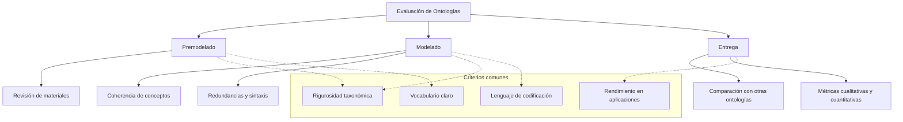
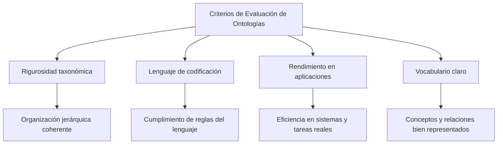

# Ingeniería del Conocimiento (TIC-1015)

## Investigación Individual

### **Título de la investigación**

**Criterios de evaluación de ontologías**

----------

### **Estudiante**

**Nombre completo:**  
Suastegui Blanco Mariana

### **Docente**

Rene Solis Reyes

### **Asignatura**

Ingeniería del Conocimiento (TIC-1015)

### **Institución**

Tecnológico Nacional de México

----------

## **1. Introducción**

Dentro de la Ingeniería del Conocimiento, las ontologías se utilizan como una herramienta importante para organizar y representar el conocimiento de un dominio específico. A través de ellas es posible definir conceptos, relaciones y reglas que permiten que los sistemas comprendan y procesen información de manera más estructurada.

Debido a que las ontologías son cada vez más utilizadas en áreas como los sistemas inteligentes, la web semántica y la gestión del conocimiento, es necesario asegurarse de que estén bien construidas y cumplan con los objetivos para los que fueron creadas. Por esta razón, la evaluación de ontologías se vuelve un proceso fundamental para verificar su calidad, coherencia y utilidad dentro de los sistemas computacionales.

----------

## **2. Objetivo**

### **Objetivo general**

Analizar los principales criterios de evaluación de ontologías propuestos por distintos autores, con el fin de comprender su importancia y su aplicación dentro de la Ingeniería del Conocimiento.

----------

## **3. Marco teórico**

Una ontología puede definirse como una forma de representar de manera formal y clara el conocimiento de un dominio específico, estableciendo un vocabulario común Una ontología se puede entender como una forma de representar el conocimiento de un área específica usando un vocabulario común que define conceptos, propiedades y relaciones. Esto ayuda a que tanto personas como sistemas interpreten la información de manera uniforme y sin confusiones.

La evaluación de ontologías es importante porque asegura que el modelo sea útil y correcto. Normalmente se hace en tres etapas: en el premodelado se revisan las fuentes de información que servirán de base; en el modelado se analiza la coherencia de los conceptos, la ausencia de redundancias y la correcta codificación; y en la entrega se compara la ontología con otras similares para medir su calidad con criterios y métricas.

Varios autores han propuesto enfoques distintos. Brewster et al. (2004) hablan de la rigurosidad taxonómica, la eficiencia en aplicaciones y la congruencia con el dominio. Obrst et al. (2007) resaltan la representación de individuos, el rendimiento de tareas y la compatibilidad con razonamiento automático. Porzel y Malaka (2004) se enfocan en vocabulario, taxonomías y relaciones semánticas. Burton-Jones et al. (2005) proponen evaluar sintaxis, semántica, pragmática y calidad social. Brank et al. (2005) consideran vocabulario, jerarquías, contexto de aplicación y estructura. Finalmente, Lozano-Tello (2002) con ONTOMETRIC incluye criterios como contenido, lenguaje, metodología, herramientas y costo.

----------

## **4. Desarrollo**

# Criterios de evaluación de ontologías
## Imagen de referencia

Una ontología consiste en una descripción formal y clara de una conceptualización compartida, la cual se distingue por definir un vocabulario común que también incluye la interpretación de los conceptos fundamentales del ámbito y sus interrelaciones. El uso de ontologías ha aumentado notablemente y se ha vuelto habitual en diversas disciplinas.

Durante el proceso de evaluación, se definen y llevan a cabo un conjunto de pruebas y se examinan los resultados de estas (Hartman, Spyns, Giboin, Maynard, Cuel, Suárez-Figueroa y Sure, 2005), tomando en cuenta tres fases de las ontologías: premodelado, modelado y entregadas (delivery).

- a) Pre-modelado: Se considera revisión y evaluación de materiales disponibles para la construcción de ontologías.

- b) Modelado: Se comprueba la calidad del significado y la coherencia y redundancia de los conceptos utilizando otras ontologías disponibles y se evalúan preguntas de competencia y posibles errores sintácticos durante la codificación.

- c) La evaluación de las ontologías entregadas consiste en determinar su calidad comparándolas con otras ontologías diferentes pero equivalentes. Para ello se elabora un conjunto de criterios cualitativos y cuantitativos, que se miden mediante un conjunto de métricas predefinidas.

## Antecedentes y enfoques de autores

Para Brewster y cols (2004), las ontologías deben evaluarse: 
- a) Desde la perspectiva de los principios usados para su construcción (rigurosidad taxonómica).
- b) Su eficiencia en el contexto de una aplicación.
- c) La congruencia entre ella y el conocimiento del dominio. 

Según Obrst y cols (2007), los criterios de evaluación a considerar son: 
- a) Representación de los individuos (consistencia y completitud del lenguaje usado para su modelado).
- b) Rendimiento de las tareas que usan la ontología.
- c) Grado de similitud con otras ontologías.
- d) La compatibilidad para realizar razonamiento automático.

El enfoque presentado por (Porzel y Malaka, 2004) se evalúan tres puntos: 
- a) Alcance del vocabulario (uso de conceptos adecuados).
- b) Taxonomías apropiadas.
- c) Las relaciones semánticas (no taxonómicas). 

Burton-Jones y cols (2005), dicen que la calidad debe medirse evaluando: 
- a) Sintaxis (cómo se aplican los componentes del lenguaje utilizado para codificar)
- b) Semántica (significado, claridad y consistencia de los términos).
- c) Pragmática (utilidad de la ontología para los agentes que la usan). 
- d) Calidad social (interacción entre la ontología y los agentes). La evaluación se lleva a cabo mediante un conjunto de métricas basadas en la teoría de la semiótica.

Brank y cols (2005), realizan una revisión de técnicas de evaluación y concluyen con lo siguiente: 
- a) Vocabulario (evaluación contra otras fuentes).
- b) Jerarquía, taxonomía y relaciones semánticas.
- c) Contexto de aplicación (rendimiento de las aplicaciones que usan las ontologías).
- d) sintaxis (cumplir con los requerimientos del lenguaje utilizado).
- e) Estructura, arquitectura y diseño (corroborar manualmente que los requerimientos preestablecidos se cumplan).

El método ONTOMETRIC (Lozano-Tello, 2002) permite seleccionar entre un conjunto de ontologías aquellas que resulten más apropiadas. Los criterios de evaluación a considerar son: 
- a) Contenido y organización.
- b) Lenguaje utilizado para la codificación.
- c) Metodología de desarrollo.
- d) Herramientas de software usadas para construir y editar la ontología.
- e) Costo de construcción

## Tabla comparativa de criterios de evaluación de ontologías

| Autor                | Criterios principales                                                                 |
|-----------------------|--------------------------------------------------------------------------------------|
| Brewster et al. (2004) | Rigurosidad taxonómica, eficiencia en aplicaciones, congruencia con el dominio       |
| Obrst et al. (2007)   | Representación de individuos, rendimiento de tareas, compatibilidad con razonamiento |
| Porzel y Malaka (2004)| Vocabulario, taxonomías, relaciones semánticas                                       |
| Burton-Jones et al. (2005) | Sintaxis, semántica, pragmática, calidad social                              |
| Brank et al. (2005)   | Vocabulario, jerarquía, contexto de aplicación, sintaxis, estructura y diseño        |
| Lozano-Tello (2002)   | Contenido, lenguaje, metodología, herramientas, costo                                |

## Criterios de evaluación 

La mayoría de las propuestas coinciden en la evaluación de los siguientes criterios:
- a) Rigurosidad taxonómica: se refiere a la correcta organización jerárquica de los conceptos, asegurando que las clasificaciones sean coherentes y sin contradicciones.
  
- b) Lenguaje utilizado para la codificación: verifica que la ontología cumpla correctamente con las reglas del lenguaje utilizado para su desarrollo.
  
- c) Rendimiento de las aplicaciones o tareas que utilizan las ontologías: analiza qué tan eficiente resulta la ontología cuando es utilizada en sistemas o tareas reales.
  
- d) Vocabulario utilizado para representar los conceptos y relaciones del dominio modelado: revisa que los conceptos y relaciones representen de forma clara y correcta el conocimiento del dominio modelado.

----------

## **5. Análisis y discusión**

La evaluación de ontologías ayuda a encontrar fallos y puntos débiles en su diseño, lo que permite mejorar la claridad y la posibilidad de reutilizar el conocimiento. Una ventaja importante es que aumenta la calidad de la información representada y hace que los sistemas que usan esas ontologías trabajen de manera más eficiente.

Por otro lado, también hay limitaciones: algunos criterios dependen mucho del contexto o pueden ser subjetivos, y las evaluaciones más técnicas suelen necesitar herramientas especializadas y conocimientos avanzados. Aun con esas dificultades, evaluar bien una ontología tiene un efecto positivo porque facilita mejores decisiones y contribuye al desarrollo de sistemas más confiables.

----------

## **6. Conclusiones**

La evaluación de ontologías es un proceso necesario dentro de la Ingeniería del Conocimiento, ya que permite asegurar que estas cumplan con su propósito y sean útiles dentro de los sistemas que las utilizan. A través de los distintos criterios y enfoques analizados, se puede concluir que no existe un único método de evaluación, sino que es necesario combinar varios criterios dependiendo del contexto y la aplicación.

Aunque el proceso de evaluación puede presentar ciertas dificultades, su correcta aplicación contribuye al desarrollo de ontologías más eficientes, claras y adecuadas para la representación del conocimiento.

----------

## **7. Aporte al repositorio**

Este trabajo aporta una recopilación clara de los principales criterios utilizados para la evaluación de ontologías, lo cual puede servir como material de apoyo para otros estudiantes de la carrera. Además, puede ser reutilizado como referencia en materias relacionadas con sistemas inteligentes, web semántica y modelado del conocimiento.

----------

## **8. Referencias**

-   Brank, J., Grobelnik, M. y Mladenic, D. (2005). _A Survey of Ontology Evaluation_.
    
-   Brewster, C., Alani, H., Dasmahapatra, S. y Wilks, Y. (2004). _Data driven ontology evaluation_.
    
-   Burton-Jones, A., Storey, V., Sugumaran, V. y Ahluwalia, P. (2005). _A Semiotic Metrics for Assessing the Quality of Ontologies_.
    
-   Hartman, J., Spyns, P., Giboin, A., Maynard, D., Cuel, R., Suárez-Figueroa, M. y Sure, Y. (2005). _Methods for Ontology Evaluation_.
    
-   Lozano, A. (2002). _Métrica de idoneidad de ontologías_.
    
-   Obrst, L., Ashpole, B., Ceusters, W., Mani, I., Ray, S. y Smith, B. (2007). _The evaluation of ontologies: Toward improved semantic interoperability_.
    
-   Porzel, R. y Malaka, R. (2004). _A Task-based Approach for Ontology Evaluation_.
    

----------

## **9. Declaración de originalidad**

Declaro que esta investigación es de autoría propia y que las fuentes utilizadas han sido debidamente citadas.

**Firma:**  
Mariana Suastegui Blanco

**Fecha:**  
10/02/2026
