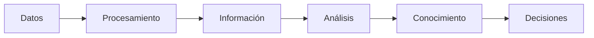
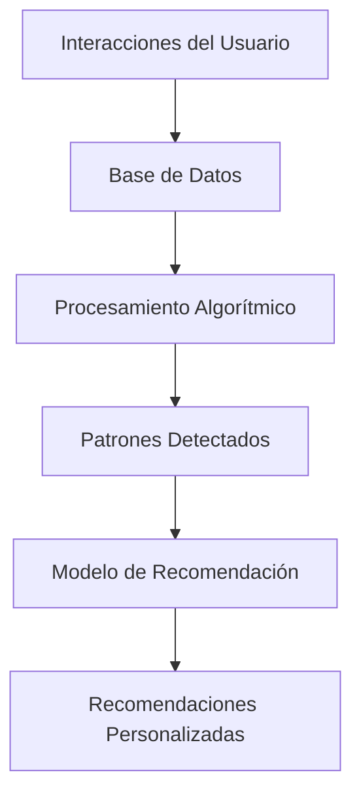

# Ingeniería del Conocimiento (TIC-1015)
## Investigación Individual

### Título de la investigación
**Diferencias entre dato, información y conocimiento en sistemas computacionales**

---

### Estudiante
**Nombre completo:**  
Benitez Garduño Kevin

### Docente
Rene Solis Reyes

### Asignatura
Ingeniería del Conocimiento (TIC-1015)

### Institución
Tecnológico Nacional de México

---

## 1. Introducción
En los sistemas computacionales, el manejo adecuado de los datos es fundamental para la generación de información útil y la creación de conocimiento que permita la toma de decisiones. En el contexto actual, donde existe una gran cantidad de datos generados diariamente (Big Data), resulta esencial comprender las diferencias entre dato, información y conocimiento, ya que estos conceptos representan distintos niveles de procesamiento y valor dentro de un sistema.

Dentro de la Ingeniería del Conocimiento, esta distinción es clave porque permite diseñar sistemas capaces de transformar datos en conocimiento útil mediante procesos de análisis, modelado y representación. El propósito de este trabajo es analizar conceptualmente estos tres elementos, explicar sus diferencias y mostrar su aplicación dentro de los sistemas computacionales modernos.

---

## 2. Objetivo
### Objetivo general
Analizar y diferenciar los conceptos de dato, información y conocimiento en sistemas computacionales, identificando sus características, relaciones y aplicaciones prácticas dentro de la Ingeniería del Conocimiento.

---

## 3. Marco teórico
### Dato

Un **dato** es la representación simbólica de un hecho, evento o característica sin contexto ni interpretación. Puede presentarse en forma de números, texto, imágenes o señales.

Ejemplo:

-   25
    
-   "A123"
    
-   2026-02-12
    

Los datos por sí solos no tienen significado hasta que son procesados.

----------

### Información

La **información** es el resultado de organizar, procesar y contextualizar datos, de manera que adquieren significado y utilidad.

Ejemplo:

-   "La temperatura actual es de 25°C."
    
-   "El cliente A123 realizó una compra el 12 de febrero de 2026."
    

La información responde preguntas como: ¿qué?, ¿quién?, ¿cuándo?, ¿dónde?

----------

### Conocimiento

El **conocimiento** surge cuando la información es interpretada, analizada y combinada con experiencia o reglas, permitiendo generar conclusiones o tomar decisiones.

Ejemplo:

-   "Si la temperatura supera los 30°C, se debe activar el sistema de refrigeración."
    
-   "El cliente A123 compra cada mes, por lo tanto es un cliente frecuente."
    

El conocimiento responde preguntas como: ¿cómo? y ¿por qué?

----------

### Modelo DIKW

Uno de los modelos más conocidos es la pirámide **DIKW (Data, Information, Knowledge, Wisdom)**:

-   **Data (Datos)** → Hechos sin procesar
    
-   **Information (Información)** → Datos organizados
    
-   **Knowledge (Conocimiento)** → Información interpretada
    
-   **Wisdom (Sabiduría)** → Aplicación estratégica del conocimiento
    

En sistemas computacionales, los tres primeros niveles son los más utilizados.

---

## 4. Desarrollo
La transformación de datos en conocimiento es un proceso que permite convertir registros crudos en decisiones estratégicas dentro de los sistemas computacionales. Este proceso es clave en Inteligencia Artificial, sistemas empresariales y análisis de datos.

Primero se capturan los datos, después se procesan para generar información y finalmente se analizan para producir conocimiento útil.

--------------------------------------------------
TABLA 1 – Comparativa general
--------------------------------------------------

Criterio        | Dato            | Información              | Conocimiento
--------------- | --------------- | ------------------------ | --------------
Naturaleza      | Crudo           | Procesado                | Interpretado
Contexto        | Sin contexto    | Con contexto             | Con experiencia
Utilidad        | Registro        | Consulta                 | Decisión
Ejemplo         | 200             | 200 ventas hoy           | Aumentar stock

--------------------------------------------------
TABLA 2 – Ejemplo en sistema de ventas
--------------------------------------------------

Nivel        | Elemento                        | Resultado
------------ | ------------------------------- | -------------------------
Dato         | 15 / Producto X / $300          | Registro
Información  | 15 unidades vendidas            | Resumen diario
Conocimiento | Alta demanda                    | Reabastecer inventario

--------------------------------------------------
TABLA 3 – Aplicación en IA
--------------------------------------------------

Nivel        | Fuente              | Resultado
------------ | ------------------- | ----------------------------
Datos        | Clics de usuario    | Historial
Información  | Categorías vistas   | Preferencias
Conocimiento | Recomendaciones     | Personalización

--------------------------------------------------
DIAGRAMA 1 – Flujo Datos a Conocimiento
--------------------------------------------------

        

----------
---

### Sistema de Inteligencia Artificial

---

### Arquitectura de Ingeniería del Conocimiento

### Caso de uso en Inteligencia Artificial

En un sistema de recomendación:

-   Datos: historial de clics del usuario.
    
-   Información: categorías más visitadas.
    
-   Conocimiento: recomendar productos similares automáticamente.
    

----------

### Esquema conceptual

`Datos → Procesamiento → Información → Análisis → Conocimiento`

---

## 5. Análisis y discusión

### Ventajas

-   Permite estructurar mejor los sistemas de información.
    
-   Mejora la toma de decisiones automatizada.
    
-   Facilita el desarrollo de sistemas inteligentes.
    
-   Optimiza el almacenamiento y uso de bases de datos.
    

### Limitaciones

-   No todos los datos generan conocimiento útil.
    
-   El conocimiento puede depender del contexto.
    
-   Un mal procesamiento produce información errónea.
    
-   La calidad del conocimiento depende de la calidad de los datos.
    

### Aplicaciones reales

-   Sistemas ERP y CRM.
    
-   Inteligencia Artificial y Machine Learning.
    
-   Sistemas expertos.
    
-   Análisis predictivo.
    
-   Gestión del conocimiento empresarial.
    

### Impacto en sistemas computacionales

La correcta transformación de datos en conocimiento permite:

-   Automatizar decisiones.
    
-   Detectar patrones.
    
-   Predecir comportamientos.
    
-   Mejorar la eficiencia operativa.
    

En Ingeniería del Conocimiento, esta transformación es esencial para diseñar sistemas capaces de aprender y adaptarse.

---

## 6. Conclusiones
La diferencia entre dato, información y conocimiento radica en el nivel de procesamiento y valor agregado que cada uno posee. Mientras el dato es un elemento básico sin contexto, la información proporciona significado y el conocimiento permite tomar decisiones fundamentadas. En los sistemas computacionales modernos, especialmente en áreas como Inteligencia Artificial y análisis de datos, esta transformación es clave para generar valor estratégico. Comprender estas diferencias permite diseñar mejores sistemas y optimizar la gestión de la información.

---

## 7. Aporte al repositorio

Esta investigación aporta una base conceptual sólida sobre los niveles de procesamiento de la información dentro de sistemas computacionales. Puede ser reutilizada como material de apoyo en materias como:

-   Ingeniería del Conocimiento
    
-   Bases de Datos
    
-   Inteligencia Artificial
    
-   Sistemas de Información
    

Además, sirve como referencia para futuros proyectos que involucren análisis de datos o desarrollo de sistemas inteligentes.

---

## 8. Referencias

-   Davenport, T. H., & Prusak, L. (1998). _Working Knowledge: How Organizations Manage What They Know_. Harvard Business School Press.
    
-   Ackoff, R. L. (1989). From Data to Wisdom. _Journal of Applied Systems Analysis_.
    
-   Russell, S., & Norvig, P. (2020). _Artificial Intelligence: A Modern Approach_. Pearson.
    
-   Laudon, K., & Laudon, J. (2021). _Sistemas de Información Gerencial_. Pearson.
    
-   Documentación oficial de IBM sobre gestión del conocimiento: [https://www.ibm.com](https://www.ibm.com)

---

## 9. Declaración de originalidad
Declaro que esta investigación es de autoría propia y que las fuentes utilizadas han sido debidamente citadas.

**Firma:**  
Kevin Benitez Garduño

**Fecha:**  
12/02/2026
