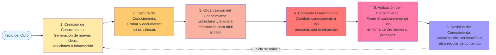

# Ingeniería del Conocimiento (TIC-1015)
## Investigación Individual

### Título de la investigación
**Gestion de conocimiento**

---

### Estudiante
**Nombre completo: Gonzalez Bolaños Martha Del Pilar** 

**Investigacion: Gestion de conocimiento: Proceso, Concepto y objetivo**

**Num. de investigacion :6**

### Docente
**Solis Reyes Rene**

### Asignatura
Ingeniería del Conocimiento (TIC-1015)

### Institución
Tecnológico Nacional de México

---

## 1. Introducción
Se desarrollo una investigacion sobre la gestion de conocimiento, la cual desarrolla su concepto general, su procesos, los cuales estan desarrollados y por ultimo su principales y mas importantes objetivos.
En la actualidad, el conocimiento se ha convertido en un recuro fundamental para las organizaciones. La gestion del conocimiento nos va a permitir organizar, compartir y aprovechar la informacion que investigemos y tambien la experiencia de las personas para mejorar el desempeño y la toma de decisiones.

---

## 2. Objetivo
### Objetivo general

Analizaremos y comprenderemos la gestion del conocimiento mediante el analisis de su concepto, procesos y objetivos, asi para reconocer su importancia en las organizaciones.

---

## 3. Marco teórico
Es un enfoque organizacional que busca aprovechar de manera eficiente el conocimiento que poseen las personas y la informacion que se genera dentro de una organizacion.
---

## 4. Desarrollo
# Gestion de Conocimiento

## Concepto 

La gestión del conocimiento es el proceso sistemático que utilizas para capturar, desarrollar, compartir y utilizar eficazmente el conocimiento dentro de tu organización. Implementar la gestión asegura que la información y los conocimientos valiosos estén accesibles para las personas adecuadas en el momento adecuado. Mejora la eficiencia, la innovación y las capacidades de toma de decisiones de tu organización.

Al enfocarte en estos aspectos de la gestión del conocimiento, puedes mejorar la toma de decisiones, crear innovación, aumentar la eficiencia y mantener la agilidad en un entorno competitivo.

## Proceso 

El ciclo se refuerza a sí mismo: el conocimiento aplicado a menudo conduce a nuevas ideas, que reinician el ciclo.

| # | Objetivo |
|---|----------|
| 1 | Justificar, formular e implantar estrategias de alcance organizacional para el desarrollo, adquisición y aplicación del conocimiento en toma de decisiones, procesos, productos y servicios, siendo un factor que debe ser evaluado dentro de la empresa. |
| 2 | Aplicar Gestión del Conocimiento enfocada a la mejora continua de los procesos de negocio, generando valor agregado a la empresa, obteniendo mayor productividad, calidad y rentabilidad. |
| 3 | Reducir los tiempos de ciclos en el desarrollo de procesos, mejoras de los ya existentes y la reducción del desarrollo de soluciones a los problemas. |
| 4 | Conocer y organizar el conjunto de activos intangibles que existen en la organización para una mejor gestión de los mismos. |
| 5 | Reducir los tiempos de búsqueda, integrar, compartir, cooperar en la creación, crear un patrimonio del conocimiento generados en una organización y adaptarlo a las necesidades temporales y estratégicas, actuales y futuras. |
| 6 | Estimular la comunicación humana, desarrollando la mayor cantidad posible de conexiones mediante la creación de una cultura con horizontes compartidos. |
| 7 | Elevar el liderazgo de las empresas en su mercado. |
| 8 | Conseguir que el conocimiento que está en las personas esté en la organización y aprovechando sus capacidades, talentos, empoderamiento y aprendizaje, permitiendo diferenciarlos y retenerlos. |
| 9 | Acelerar el ritmo del aprendizaje asociado a la Gestión del Conocimiento organizativo demostrando aporta valor a la empresa. |
| 10 | Asumir una constante vigilancia del cambio y estimular la innovación. |
| 11 | Divulgar el conocimiento, por ejemplo, lecciones aprendidas y prácticas para que todos los miembros de la organización puedan utilizar el conocimiento en el contexto de sus actividades diarias, reduciendo los costos asociados a la repetición de errores. |
| 12 | Facilitar e incentivar la efectiva y eficiente generación de nuevo conocimiento, actividades de investigación, innovación, aprendizaje, etc. estando en una constante vigilancia al cambio, haciéndolo parte integral de la metodología a aplicar. |
    

---

## 5. Análisis y discusión
Esto representa un elemento clave dentro de las organizaciones modernas, ya que permite tranformar la informacion y la experiencia de las personas en un recurso estrategico.
---

## 6. Conclusiones
La gestion del conocimiento permite organizar y aprovechar la informacion y la experiencia dentro de una organizacion.
---

## 7. Aporte al repositorio
Aporta una mejora organizacion de la informacion, facilita el intercambio de ideas, fortalece el aprendizaje continuo y mejora la toma de decisiones.

---

## 8. Referencias
QuestionPro. (s. f.). Gestión del conocimiento: Qué es, tipos y casos de uso. 
https://www.questionpro.com/blog/es/gestion-del-conocimiento/

Guru. (2025, 13 de julio). Proceso de gestión del conocimiento: Una guía completa paso a paso. 
https://www.getguru.com/es/reference/knowledge-management-process

Objetivos de la Gestión del Conocimiento. (s. f.). En Gestión del conocimiento en el capital intelectual y producción académico/científica de las unidades de postgrado de la Universidad Nacional de San Agustín de Arequipa (pp. 62-65).
https://1library.co/article/objetivos-gesti%C3%B3n-conocimiento-gesti%C3%B3n-conocimiento.yj7jexky

---

## 9. Declaración de originalidad
Declaro que esta investigación es de autoría propia y que las fuentes utilizadas han sido debidamente citadas.

**Firma:**  
Gonzalez Bolaños Martha Del Pilar

**Fecha:**  
10/2/2026
