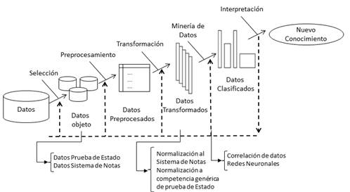

# Ingeniería del Conocimiento (TIC-1015)
## Investigación Individual

### Título de la investigación
**[Minería de datos como técnica de extracción de conocimiento]**

---

### Estudiante
**Nombre completo:* Carlos Eduardo Villalobos Sanchez*  

### Docente
[Nombre del docente] RENE SOLIS REYES

### Asignatura
Ingeniería del Conocimiento (TIC-1015)

### Institución
Tecnológico Nacional de México

---

## 1. Introducción

*La minería de datos es una disciplina fundamental dentro de la       Ingeniería del Conocimiento, ya que permite transformar grandes       volúmenes de datos en información útil para la toma de decisiones. En    la actualidad, las organizaciones generan enormes cantidades de datos    provenientes de sistemas transaccionales, redes sociales, sensores,      plataformas digitales y procesos empresariales. Sin embargo, estos       datos por sí solos carecen de valor si no son analizados e       interpretados adecuadamente. En este contexto, la minería de datos       surge como una técnica clave para la extracción de conocimiento,       utilizando métodos estadísticos, algoritmos de aprendizaje automático    y herramientas de análisis avanzado. Su importancia radica en la       capacidad de descubrir patrones ocultos, tendencias, correlaciones y     comportamientos que no son evidentes a simple vista. El propósito de     esta investigación es analizar la minería de datos como técnica de       extracción de conocimiento, abordando sus fundamentos teóricos,       procesos, aplicaciones y su impacto dentro de los sistemas basados en    conocimiento.*

### Diagrama del Proceso KDD

---

## 2. Objetivo
### Objetivo general
Analizar la minería de datos como técnica de extracción de conocimiento, identificando sus métodos, procesos, herramientas y aplicaciones dentro de la Ingeniería del Conocimiento para comprender su importancia en la toma de decisiones y en el desarrollo de sistemas inteligentes.

---

## 3. Marco teórico
La minería de datos (Data Mining) es el proceso de descubrir conocimiento útil a partir de grandes conjuntos de datos mediante el uso de técnicas computacionales, estadísticas y de inteligencia artificial.

**Conceptos fundamentales**

**Dato:** Representación simbólica de un atributo o variable sin procesar.

**Información:** Conjunto de datos procesados con significado.

**Conocimiento:** Interpretación de la información que permite la toma de decisiones.

La minería de datos forma parte del proceso KDD, el cual incluye las siguientes

| Etapa                | Descripción                                                                 | Objetivo principal                          |
|----------------------|-----------------------------------------------------------------------------|---------------------------------------------|
| Selección de datos   | Identificación y recopilación de fuentes de datos relevantes                | Obtener datos útiles para el análisis       |
| Preprocesamiento     | Limpieza, eliminación de ruido y datos incompletos                          | Mejorar la calidad de los datos             |
| Transformación       | Conversión y preparación de datos para el modelado                          | Facilitar el uso de algoritmos              |
| Minería de datos     | Aplicación de técnicas y algoritmos inteligentes                            | Descubrir patrones y conocimiento           |
| Interpretación       | Análisis de resultados y validación del conocimiento obtenido               | Apoyar la toma de decisiones                | Aplicación de algoritmos
 

Técnicas principales de minería de datos

| Técnica                  | Descripción                                              | Ejemplo de uso                          |
|--------------------------|----------------------------------------------------------|-----------------------------------------|
| Clasificación            | Asigna datos a categorías predefinidas                   | Correos spam / no spam                  |
| Regresión                | Predice valores numéricos continuos                      | Pronóstico de ventas                    |
| Clustering               | Agrupa datos por similitud                               | Segmentación de clientes                |
| Reglas de asociación     | Detecta relaciones entre variables                       | Productos comprados juntos              |
| Detección de anomalías   | Identifica comportamientos inusuales  

---

## 4. Desarrollo
La minería de datos combina diversas áreas como bases de datos, estadística, aprendizaje automático y visualización de información. Su desarrollo ha sido impulsado por el crecimiento del Big Data y la necesidad de automatizar el análisis de información.

**Funcionamiento general**

**Recolección de datos.**
**Integración de múltiples fuentes.**
**Limpieza de inconsistencias.**
**Aplicación de algoritmos.**
**Generación de modelos predictivos**

 **Ejemplos aplicados**
 
**Comercio electrónico:**
    Permite recomendar productos según el historial de compras.
**Sector bancario:** Detecta fraudes mediante patrones de transacciones.
**Salud:** Predice enfermedades con base en historiales clínicos.
**Educación:** Analiza el rendimiento estudiantil para prevenir deserción.

## 5. Análisis y discusión
La minería de datos presenta múltiples ventajas dentro de la extracción de conocimiento. Entre ellas destaca la automatización del análisis de grandes volúmenes de información, la precisión en predicciones y la identificación de patrones complejos.

**Ventajas**
Procesamiento masivo de datos.
Mejora la toma de decisiones.
Detecta tendencias futuras.
Reduce riesgos empresariales.

**Limitaciones**

Dependencia de la calidad de datos.
Alto costo de implementación.
Requiere personal especializado.
Riesgos de privacidad.

**Aplicaciones reales**
Empresas como Google, Amazon y bancos internacionales utilizan minería de datos para personalización de servicios, análisis de mercado y seguridad informática.
                            
  **Impacto en sistemas computacionales**
Ha permitido el desarrollo de sistemas inteligentes capaces de aprender de los datos, como:

**Sistemas expertos.**
**Inteligencia de negocios (BI).**
**Machine Learning.**
**Analítica predictiva.**

## 6. Conclusiones
La minería de datos representa una de las técnicas más relevantes para la extracción de conocimiento dentro de la Ingeniería del Conocimiento. Su capacidad para analizar grandes volúmenes de información y convertirlos en conocimiento útil la posiciona como una herramienta estratégica en organizaciones modernas. A través de sus diferentes técnicas, es posible predecir comportamientos, optimizar procesos y mejorar la toma de decisiones. No obstante, su efectividad depende de la calidad de los datos y del correcto uso de los algoritmos. En conclusión, la minería de datos no solo facilita el análisis de información, sino que impulsa la innovación tecnológica y el desarrollo de sistemas inteligentes orientados al conocimiento.

---

## 7. Aporte al repositorio
Esta investigación aporta al repositorio académico información estructurada sobre la minería de datos como técnica de extracción de conocimiento. Puede ser reutilizada por estudiantes como base teórica para proyectos de análisis de datos, inteligencia artificial o sistemas de apoyo a decisiones. 
 Asimismo, sirve como material de consulta para futuras asignaturas relacionadas con Big Data, Machine Learning e Ingeniería del Conocimiento.

---

## 8. Referencias
Han, J., Kamber, M., & Pei, J. (2012). Data Mining: Concepts and Techniques. Morgan Kaufmann. Witten, I., Frank, E., & Hall, M. (2016). Data Mining: Practical Machine Learning Tools and Techniques. Morgan Kaufmann. Hernández, J., Ramírez, M., & Ferri, C. (2004). Introducción a la minería de datos. Pearson. IBM. (2023). What is Data Mining? https://www.ibm.com Microsoft. (2024). Data Mining Concepts. https://learn.microsoft.com

---

## 9. Declaración de originalidad
Declaro que esta investigación es de autoría propia y que las fuentes utilizadas han sido debidamente citadas. 
**Firma:**  
Carlos Eduardo Villalobos Sanchez

**Fecha:**  
[10/02/2026]
