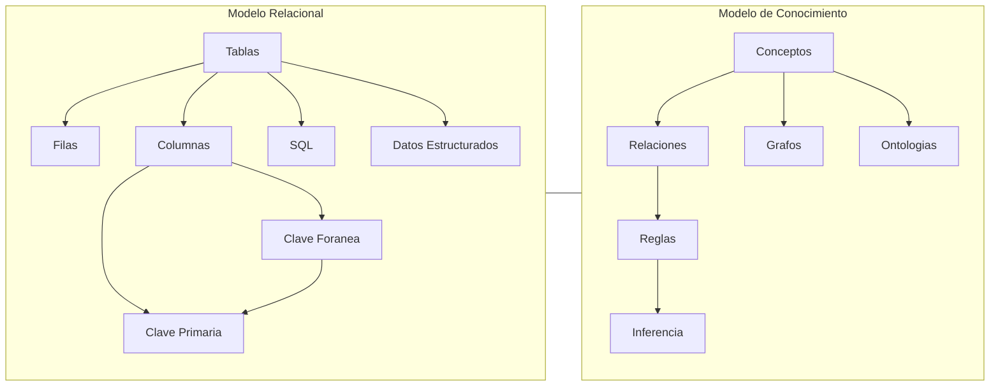

# Ingeniería del Conocimiento (TIC-1015)
## Investigación Individual

### Título de la investigación
**[Modelos relacionales de datos vs modelos de conocimiento]**

---

### Estudiante
**Nombre completo:**  
[Marquez Cardenas Daniel]

### Docente
[RENE SOLIS REYES]

### Asignatura
Ingeniería del Conocimiento (TIC-1015)

### Institución
Tecnológico Nacional de México

---

## 1. Introducción
Lo que se busca de este trebajo es investigar e informar sobre cuales son las diferencias sobre los modelos relacionales y modelos del conocimiento mostrando
sus ventajas, desventajas, caracteristicas de cada uno respectivamente.
Este trabajo presenta una comparación entre ambos modelos, describiendo sus características, ventajas, desventajas y aplicaciones, con el fin de comprender sus 
diferencias y su importancia en los sistemas modernos de información e inteligencia artificial.

---

## 2. Objetivo
Objetivo generalAnalizar y comparar los modelos relacionales de datos y los modelos de conocimiento, identificando sus características, ventajas, limitaciones
y aplicaciones en sistemas computacionales y de gestión de información.

---

## 3. Marco teórico
Modelo relacional de datos

El modelo relacional de datos fue propuesto por Edgar F. Codd en 1970. Este modelo organiza la información en tablas llamadas relaciones, compuestas por filas (tuplas)
y columnas (atributos). Cada tabla representa una entidad y las relaciones entre tablas se establecen mediante claves primarias y foráneas.

Características principales:

Estructura basada en tablas

Uso de claves primarias y foráneas

Integridad de datos

Lenguaje de consulta SQL

Independencia de datos

Es el modelo más utilizado en bases de datos tradicionales como MySQL, PostgreSQL, SQL Server y Oracle.

Modelos de conocimiento

Los modelos de conocimiento se utilizan para representar información de forma semántica, conceptual y lógica. Son comunes en inteligencia artificial, sistemas expertos e ingeniería 
del conocimiento. No solo almacenan datos, sino también significado, relaciones conceptuales y reglas de inferencia.

Tipos comunes de modelos de conocimiento:

Ontologías

Redes semánticas

Marcos (frames)

Reglas de producción

Grafos de conocimiento

Características principales:

Representan conceptos y relaciones

Permiten inferencia lógica

Usan semántica explícita

Se aplican en IA y sistemas expertos

---

## 4. Desarrollo
Modelo relacional — funcionamiento

En el modelo relacional, los datos se organizan en tablas:

Ejemplo:

Tabla Clientes

| ID | Nombre | Ciudad   |
| -- | ------ | -------- |
| 1  | Ana    | Tijuana  |
| 2  | Luis   | Mexicali |

Tabla Pedidos

| ID | ClienteID | Producto |
| -- | --------- | -------- |
| 10 | 1         | Laptop   |
| 11 | 2         | Monitor  |

La relación se establece por ClienteID → ID.

Ventajas:

Fácil de entender

Alta consistencia

Consultas eficientes

Muy estandarizado

---
Modelo de conocimiento — funcionamiento

En un modelo de conocimiento, la información se representa como conceptos conectados por relaciones semánticas.

Ejemplo tipo grafo:

Laptop → es_un → Dispositivo
Laptop → requiere → Energía
Energía → tipo → Eléctrica

O en forma de regla:

SI dispositivo = laptop
Y batería = baja
ENTONCES recomendar = cargar

Ventajas:

Representa significado

Permite razonamiento

Flexible

Ideal para IA

---

Tabla comparativa
| Aspecto        | Modelo Relacional   | Modelo de Conocimiento     |
| -------------- | ------------------- | -------------------------- |
| Representación | Tablas              | Grafos, reglas, ontologías |
| Enfoque        | Datos estructurados | Significado y relaciones   |
| Lenguaje       | SQL                 | Lógico/semántico           |
| Uso principal  | Bases de datos      | IA y sistemas expertos     |
| Inferencia     | No                  | Sí                         |
| Flexibilidad   | Media               | Alta                       |

---

## 5. Análisis y discusión
Los modelos relacionales son ideales para sistemas transaccionales, administrativos y empresariales donde la consistencia y estructura son fundamentales. Son rápidos, confiables
y ampliamente soportados.

Los modelos de conocimiento, en cambio, son más adecuados para sistemas que requieren interpretación, razonamiento y contexto, como asistentes inteligentes, motores de recomendación
y sistemas expertos.

Ventajas del modelo relacional:

Alto rendimiento

Estabilidad

Amplio soporte

Fácil mantenimiento

Limitaciones:

Poca representación semántica

No permite inferencias

Ventajas del modelo de conocimiento:

Representación semántica rica

Permite inferencias

Mayor flexibilidad conceptual

Limitaciones:

Más complejo

Menor estandarización

Mayor costo computacional

Impacto en sistemas:
Los sistemas modernos combinan ambos modelos: bases relacionales para almacenamiento y modelos de conocimiento para análisis inteligente.

 1. Modelo Relacional de Datos

El modelo relacional fue propuesto por Edgar F. Codd en 1970 y se basa en la organización de datos en **tablas (relaciones)** compuestas por filas y columnas.

 Funcionamiento

- Cada **tabla** representa una entidad.
- Cada **fila** representa un registro.
- Cada **columna** representa un atributo.
- Las tablas se relacionan mediante **claves primarias y foráneas**.
- Se utiliza el lenguaje **SQL** para manipular la información.

 Características principales

- Estructura fija y bien definida.
- Integridad referencial.
- Normalización para evitar redundancia.
- Consultas estructuradas y optimizadas.

Ventajas

- Alta consistencia de datos.
- Seguridad y control de acceso.
- Rendimiento eficiente en grandes volúmenes estructurados.
- Estándar ampliamente adoptado en empresas.

Limitaciones

- Menor flexibilidad ante cambios estructurales.
- No está diseñado para representar significado profundo.
- No permite inferencia automática.

---

2. Modelo de Conocimiento

El modelo de conocimiento se enfoca en representar **conceptos, relaciones y reglas**, no solo datos. Es común en áreas como:

- Inteligencia Artificial
- Sistemas expertos
- Web semántica
- Ontologías

Funcionamiento

La información se representa mediante:

- Grafos semánticos
- Redes conceptuales
- Reglas lógicas (SI-ENTONCES)
- Ontologías

## Diagrama Comparativo

---

## 6. Conclusiones
Los modelos relacionales de datos y los modelos de conocimiento cumplen funciones diferentes pero complementarias. El modelo relacional es la base de la gestión estructurada de datos y 
continúa siendo esencial en aplicaciones empresariales. Por otro lado, los modelos de conocimiento permiten representar significado, contexto y relaciones conceptuales, siendo fundamentales 
en inteligencia artificial.

La tendencia actual apunta a integrar ambos enfoques para lograr sistemas más inteligentes, capaces no solo de almacenar datos sino de interpretarlos y razonar con ellos.

---

## 7. Aporte al repositorio
Esta investigación aporta una comparación clara y estructurada entre dos modelos fundamentales de representación de información. Puede servir como material de consulta para futuros estudiantes
en cursos de bases de datos, inteligencia artificial e ingeniería del conocimiento, facilitando la comprensión de sus diferencias y aplicaciones.

---

## 8. Referencias

Codd, E. F. (1970). A Relational Model of Data for Large Shared Data Banks. Communications of the ACM.

Silberschatz, A., Korth, H., & Sudarshan, S. (2019). Database System Concepts. McGraw-Hill.

Russell, S., & Norvig, P. (2021). Artificial Intelligence: A Modern Approach. Pearson.

IBM. (2023). Modelos de bases de datos.

Oracle. (2024). Conceptos de bases de datos relacionales.

W3C. Ontologies and Knowledge Representation.

---

## 9. Declaración de originalidad
Declaro que esta investigación es de autoría propia y que las fuentes utilizadas han sido debidamente citadas.

**Firma:**  
[Marquez Cardenas Daniel]

**Fecha:**  
[10/02/2026]
