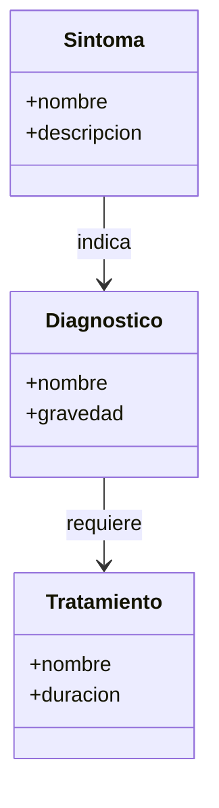
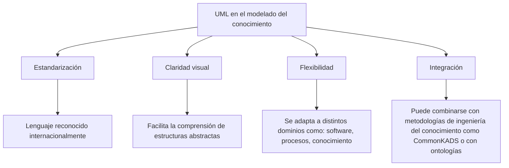

# Ingeniería del Conocimiento (TIC-1015)
## Investigación Individual


### Título de la investigación
**Uso de diagramas UML en el modelado del conocimiento**

---

### Estudiante
**Nombre completo:**  
Lopez Aguilar Rocio Stephannie

### Docente
Rene Solis Reyes

### Asignatura
Ingeniería del Conocimiento (TIC-1015)

### Institución
Tecnológico Nacional de México

---

## 1. Introducción
El modelado del conocimiento es una disciplina fundamental dentro de la Ingeniería del Conocimiento, ya que permite representar de manera estructurada la información, conceptos y procesos de un dominio específico. Su importancia radica en que facilita la comprensión, el intercambio y la aplicación del conocimiento tanto por personas como por sistemas informáticos, siendo clave en el desarrollo de sistemas expertos, inteligencia artificial y gestión del conocimiento.

En este contexto, el Lenguaje Unificado de Modelado (UML) se convierte en una herramienta poderosa, pues ofrece un lenguaje visual estandarizado para describir y organizar el conocimiento mediante diagramas. UML no solo se utiliza en el diseño de software, sino también en la representación de estructuras conceptuales, relaciones y flujos de información, lo que lo hace especialmente útil para formalizar y comunicar el conocimiento de manera clara y precisa.

El propósito general de este trabajo es analizar cómo UML puede aplicarse en el modelado del conocimiento, destacando su relevancia como puente entre la teoría y la práctica, y mostrando ejemplos de diagramas que permiten visualizar conceptos, procesos y sistemas de manera efectiva.

---

## 2. Objetivo
### Objetivo general
Analizar y demostrar cómo el Lenguaje Unificado de Modelado (UML) puede aplicarse en el modelado del conocimiento, utilizando diagramas estandarizados para representar conceptos, procesos y relaciones, con el fin de facilitar la comprensión, comunicación y gestión del conocimiento dentro de la Ingeniería del Conocimiento.

---

## 3. Marco teórico
El modelado del conocimiento es una disciplina que busca representar de manera estructurada la información, conceptos y relaciones de un dominio específico, con el fin de que puedan ser comprendidos, compartidos y utilizados tanto por personas como por sistemas informáticos. Este proceso es esencial en la Ingeniería del Conocimiento, ya que permite transformar el conocimiento tácito en conocimiento explícito y formalizado.

### 3.1 Definición de UML
El Lenguaje Unificado de Modelado (UML) es un lenguaje visual estandarizado que facilita la representación de sistemas complejos mediante diagramas. Fue creado para unificar diferentes métodos de modelado y se ha convertido en una herramienta ampliamente utilizada en el diseño de software y en la representación de estructuras conceptuales.

### 3.2 Clasificación de diagramas UML
UML se compone de diversos tipos de diagramas, que se dividen en dos grandes categorías:

- Diagramas estructurales: muestran la organización estática del sistema (ej. diagramas de clases, de componentes, de objetos).

- Diagramas de comportamiento: representan la dinámica del sistema (ej. diagramas de casos de uso, de secuencia, de actividad).

### 3.3 Modelado del conocimiento
El modelado del conocimiento se refiere al proceso de identificar, organizar y formalizar el conocimiento de un dominio. Incluye:

- Conceptos: entidades principales del dominio.
- Relaciones: vínculos entre los conceptos.
- Procesos: actividades que transforman o utilizan el conocimiento.
- Reglas: condiciones que guían la aplicación del conocimiento.

### 3.4 Relación entre UML y el modelado del conocimiento
UML se utiliza como herramienta para representar gráficamente el conocimiento, ya que:
- Permite formalizar conceptos mediante diagramas de clases.
- Facilita la visualización de procesos con diagramas de actividad.
- Representa interacciones entre actores y sistemas con diagramas de casos de uso.
- Ayuda a comunicar y compartir conocimiento de manera clara y estandarizada.

---

## 4. Desarrollo


## 4.1. ¿Qué es UML?
  - Unified Modeling Language (UML) es un lenguaje estándar de modelado visual.

  - Se utiliza para representar sistemas complejos mediante diagramas.

  - Facilita la comunicación entre desarrolladores, analistas y usuarios.


## 4.2. ¿Qué es el modelado del conocimiento?
  El modelado del conocimiento es el proceso de representar de manera estructurada la información, conceptos y relaciones de un dominio              específico, con el fin de que puedan ser comprendidos, compartidos y utilizados por personas o sistemas.

  - Busca transformar el conocimiento tácito (lo que saben los expertos) en conocimiento explícito (documentado y formalizado).

  - Se apoya en diagramas, ontologías y lenguajes de representación para organizar la información.

  - Es fundamental en áreas como la inteligencia artificial, sistemas expertos y gestión del conocimiento.

  👉 En pocas palabras: el modelado del conocimiento es dar forma visual y lógica al saber, para que pueda ser procesado y aplicado de manera         sistemática.-


## 4.3. Relación entre UML y el conocimiento

  - UML no solo describe software, también puede representar estructuras de conocimiento.

  - Permite formalizar conceptos, procesos y relaciones en un sistema basado en conocimiento.

  - Se usa como puente entre la representación conceptual y la implementación técnica.


## 4.4. Diagramas UML más relevantes para el conocimiento
  **Diagramas de clases:** representan conceptos, atributos y relaciones (útiles para ontologías).
  
*Ejemplo:*

<p align="center">Sistema de gestión de conocimiento médico</p>




  **Diagramas de casos de uso:** muestran cómo los actores interactúan con el sistema de conocimiento.

  *Ejemplo:*

  <p align="center">Sistema de soporte a la decisión clínica</p>

  ```mermaid
flowchart LR
    Doctor --> ConsultarSintomas
    Doctor --> RegistrarDiagnostico
    Doctor --> AsignarTratamiento
```


  **Diagramas de secuencia:** ilustran el flujo de información y razonamiento.

  *Ejemplo:*
  
  <p align="center">Sistema experto médico</p>

  ```mermaid
  sequenceDiagram
    participant Doctor
    participant Sistema
    participant BaseDeConocimiento

    Doctor->>Sistema: Ingresa síntomas
    Sistema->>BaseDeConocimiento: Consulta reglas
    BaseDeConocimiento-->>Sistema: Devuelve diagnóstico
    Sistema-->>Doctor: Muestra diagnóstico sugerido
```

  **Diagramas de actividad:** modelan procesos de toma de decisiones o flujos de conocimiento.

*Ejemplo:*

  <p align="center">Sistema de procesos clínicos</p>

 ```mermaid
flowchart TD
    A[Paciente llega] --> B[Evaluar síntomas]
    B --> C{¿Síntomas graves?}
    C -- Sí --> D[Diagnóstico urgente]
    C -- No --> E[Realizar estudios]
    D --> F[Asignar tratamiento]
    E --> F
```


## 4.5. Ventajas de usar UML en este contexto



## 4.6. Ejemplos de aplicación

 - *Modelar* una base de conocimiento médica con clases que representan síntomas, diagnósticos y tratamientos.

 - *Representar* procesos de inteligencia de negocios con diagramas de actividad.

 - *Diseñar* sistemas expertos mostrando reglas y relaciones mediante diagramas de clases.

---


## 5. Análisis y discusión

### 5.1 Ventajas y limitaciones

| Ventajas | Limitaciones |
|----------|-------------|
| Lenguaje visual estandarizado que facilita la comunicación entre expertos y desarrolladores. | Fue diseñado principalmente para el desarrollo de software, por lo que puede requerir adaptaciones en el modelado del conocimiento. |
| Permite formalizar conceptos abstractos y representarlos de manera clara. | No siempre captura la semántica profunda del conocimiento (reglas lógicas o inferencias complejas). |
| Favorece la interoperabilidad con metodologías de ingeniería del conocimiento. | Puede resultar complejo para personas que no están familiarizadas con la notación UML. |
| Flexible: aplicable tanto en sistemas de software como en modelos conceptuales. | En sistemas muy grandes, los diagramas pueden volverse difíciles de interpretar. |


### 5.2 Aplicaciones reales

| Área | Ejemplo de uso | Función en el modelado del conocimiento |
|------|----------------|----------------------------------------|
| Sistemas expertos médicos | Modelar síntomas, diagnósticos y tratamientos | Facilita la construcción de bases de conocimiento clínicas |
| Inteligencia de negocios | Diagramas de actividad | Representa procesos de análisis de datos y toma de decisiones |
| Educación | Estructurar contenidos y procesos de aprendizaje | Mejora la organización de plataformas digitales educativas |
| Gestión del conocimiento organizacional | Mapear procesos internos y flujos de información | Optimiza la gestión de información dentro de la empresa |


### 5.3 Impacto en la toma de decisiones y sistemas computacionales

- UML mejora la claridad y comprensión de los modelos de conocimiento, lo que permite tomar decisiones más informadas.

- Al representar procesos y relaciones, facilita la detección de inconsistencias y la optimización de sistemas.

- En sistemas computacionales, UML contribuye a la automatización del conocimiento, ya que los diagramas pueden servir como base para implementar reglas y algoritmos.

- Su uso fomenta la colaboración interdisciplinaria, integrando expertos en conocimiento con desarrolladores de software.

---

## 6. Conclusiones

El análisis realizado permite afirmar que el Lenguaje Unificado de Modelado (UML) constituye una herramienta eficaz para representar y estructurar el conocimiento dentro de la Ingeniería del Conocimiento. Su uso aporta claridad en la comunicación entre expertos y desarrolladores, facilita la formalización de conceptos y procesos, y contribuye a la construcción de sistemas más comprensibles y organizados.

Se identificó que, aunque UML fue concebido principalmente para el diseño de software, su aplicación en el modelado del conocimiento amplía su alcance hacia ámbitos como la educación, la gestión organizacional y los sistemas expertos. Esta versatilidad lo convierte en un puente entre la teoría y la práctica, permitiendo que el conocimiento se traduzca en representaciones visuales útiles para la toma de decisiones.

Finalmente, se concluye que UML, al integrarse en el modelado del conocimiento, fortalece la capacidad de los sistemas computacionales para procesar, compartir y aplicar información de manera eficiente, consolidándose como un recurso estratégico en la evolución de la Ingeniería del Conocimiento.

---

## 7. Aporte al repositorio

Esta investigación aporta al repositorio un documento estructurado y fundamentado sobre el uso de UML en el modelado del conocimiento, integrando definiciones, ejemplos prácticos y análisis crítico. Con ello, se enriquece el acervo académico disponible y se ofrece un recurso que puede servir como referencia para futuros trabajos en el área de la Ingeniería del Conocimiento.

Además, este material puede ser reutilizado por otros estudiantes o cursos futuros como:

- Guía de estudio para comprender la relación entre UML y el modelado del conocimiento.

- Base de ejemplos (diagramas, casos de uso, tablas) que pueden adaptarse a distintos dominios de aplicación.

- Referencia metodológica para estructurar investigaciones similares, siguiendo un formato claro y organizado.

- Apoyo en proyectos académicos donde se requiera representar procesos, conceptos o sistemas mediante UML.

De esta manera, el repositorio se fortalece como un espacio colaborativo que fomenta el aprendizaje, la reutilización de recursos y la construcción colectiva del conocimiento.

---

## 8. Referencias

- UML. (s. f.). Lucidchart. Recuperado 10 de febrero de 2026, de https://www.lucidchart.com/pages/es/que-es-el-lenguaje-unificado-de-modelado-uml?

- TecnoDigital. (2025, 9 febrero). Guía completa sobre el Lenguaje Unificado de Modelado UML. Informática y Tecnología Digital. https://informatecdigital.com/que-es-el-lenguaje-unificado-de-modelado-uml/

- Modelado del conocimiento _ AcademiaLab. (s. f.). https://academia-lab.com/enciclopedia/modelado-del-conocimiento

- Del Rocío Ramírez Jiménez, M., Hernández, K. P., Orozco, C. E. R., Torres, N. A. G., Zúñiga, L. S., & Torres, L. M. O. (2024). UML: Una manera de representar, interpretar, analizar y desarrollar el pensamiento computacional. RIDE Revista Iberoamericana Para la Investigación y el Desarrollo Educativo, 15(29). https://doi.org/10.23913/ride.v15i29.2196

---


## 9. Declaración de originalidad
Declaro que esta investigación es de autoría propia y que las fuentes utilizadas han sido debidamente citadas.

**Firma:**  
Lopez Aguilar Rocio Stephannie

**Fecha:**  
10/02/2026
