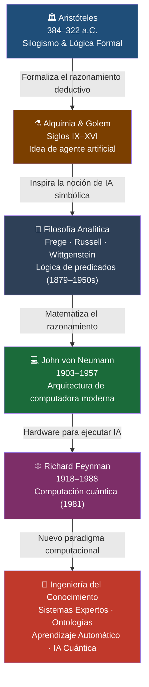

# Antecedentes de la Ingeniería del Conocimiento

| | |
|---|---|
| **Estudiante** | Bustillos Ortiz, José Luis |
| **Docente** | René Solís Reyes |
| **Asignatura** | Ingeniería del Conocimiento (TIC-1015) |
| **Institución** | Tecnológico Nacional de México |
| **Fecha** | 10 de febrero de 2026 |

---

## 1. Introducción

La Ingeniería del Conocimiento es una disciplina relativamente moderna, pero sus fundamentos vienen de mucho tiempo atrás. En esta investigación se exploran los antecedentes históricos más importantes que condujeron al desarrollo de esta área, trazando una línea desde la lógica formal griega hasta los paradigmas computacionales del siglo XX.

Se revisarán las contribuciones de Aristóteles en lógica formal, el papel de la filosofía analítica en la formalización del razonamiento, las ideas proto-artificiales de la alquimia sobre crear inteligencia, y finalmente las aportaciones fundamentales de von Neumann y Feynman a la computación moderna. El objetivo central es entender de dónde provienen las ideas que hoy sustentan a los sistemas inteligentes.

---

## 2. Objetivo

Conocer y analizar los principales antecedentes históricos de la Ingeniería del Conocimiento, estableciendo conexiones entre:

- La lógica formal de Aristóteles y los sistemas expertos modernos.
- Las ideas alquímicas sobre inteligencia artificial y los actuales agentes autónomos.
- La filosofía analítica (Frege, Russell, Wittgenstein) y los lenguajes de programación lógica.
- La arquitectura de von Neumann y la computación cuántica propuesta por Feynman.

---

## 3. Marco Teórico

**Ingeniería del Conocimiento:** Disciplina dedicada a construir sistemas computacionales que emplean conocimiento estructurado para resolver problemas complejos, emulando la capacidad de razonamiento de un experto humano.

**Conocimiento:** Información contextualizada y organizada que puede aplicarse para tomar decisiones o resolver problemas.

**Razonamiento:** Proceso cognitivo —o su simulación computacional— mediante el cual se extraen conclusiones lógicas a partir de premisas o hechos conocidos.

**Lógica formal:** Sistema de reglas y símbolos que permite razonar de manera rigurosa, independientemente del contenido semántico de las proposiciones.

---

## 4. Desarrollo

### 4.1 Aristóteles y la lógica formal

Aristóteles (384–322 a.C.) fue el primero en sistematizar el razonamiento mediante el **silogismo**: una estructura argumental compuesta por dos premisas y una conclusión que se sigue necesariamente de ellas. Este mecanismo deductivo constituye el ancestro directo de los sistemas de producción que hoy emplean los sistemas expertos.

El ejemplo canónico del silogismo aristotélico es:

- Todos los humanos son mortales *(premisa mayor)*
- Sócrates es humano *(premisa menor)*
- Por lo tanto, Sócrates es mortal *(conclusión)*

En términos computacionales, esta estructura equivale a las reglas de inferencia de la forma `SI...ENTONCES` que usa Prolog y los shells de sistemas expertos como CLIPS o JESS:

```prolog
SI animal(X) Y mamifero(X)
ENTONCES tiene_sangre_caliente(X)
```

La relevancia de Aristóteles radica en que separó la **forma** del argumento de su **contenido**, lo que hace posible que una máquina razone correctamente sin comprender el significado de los símbolos que procesa.

---

### 4.2 La alquimia y la idea de crear inteligencia

La alquimia medieval y renacentista no se limitaba a la transmutación de metales; también albergaba el sueño de fabricar inteligencia artificial. Dos figuras son especialmente ilustrativas al respecto.

**El homúnculo de Paracelso:** En el siglo XVI, Paracelso describió un procedimiento para crear un ser humano artificial en el laboratorio a partir de materia orgánica. Más allá de su imposibilidad empírica, el concepto anticipa la aspiración moderna de sintetizar comportamiento inteligente desde materiales inertes.

**El Golem de la tradición judía:** Ser de arcilla animado por inscripciones cabalísticas —concretamente la palabra *emet* (verdad)— y desactivado borrando una letra. Este mito es notablemente análogo al concepto moderno de instrucción:

| Golem | Computadora moderna |
|---|---|
| Recibía órdenes mediante símbolos | Ejecuta instrucciones en código |
| Se activaba/desactivaba con una letra | Estado encendido/apagado (bit) |
| Operaba dentro de límites fijos | La IA actual tiene restricciones definidas |
| Creado para servir a su creador | El software ejecuta la voluntad del programador |

Estas narrativas demuestran que la inteligencia artificial no es solo un producto del siglo XX: es una aspiración humana milenaria que la tecnología contemporánea finalmente está en condiciones de materializar.

---

### 4.3 Filosofía analítica

Durante los siglos XIX y XX, tres filósofos convirtieron el razonamiento lógico en un formalismo matemático procesable, sentando las bases de la programación y la inteligencia artificial.

**Gottlob Frege (1848–1925):** Desarrolló la lógica de predicados de primer orden, superando las limitaciones del silogismo aristotélico. Su notación formal permite expresar relaciones complejas entre objetos, algo indispensable para la representación del conocimiento en ontologías y bases de conocimiento.

**Bertrand Russell (1872–1970):** Junto a Alfred North Whitehead, intentó fundamentar toda la matemática en la lógica (logicismo). Aunque Gödel demostró que este proyecto era incompleto, los *Principia Mathematica* influyeron directamente en el diseño de lenguajes formales y en la verificación automática de programas.

**Ludwig Wittgenstein (1889–1951):** Su análisis de los juegos de lenguaje y los actos de habla anticipó el procesamiento del lenguaje natural. La distinción entre lo que puede *decirse* y lo que solo puede *mostrarse* resuena hoy en los límites de los modelos de lenguaje como GPT o Claude.

Gracias a estos filósofos, hoy contamos con herramientas como lenguajes de programación lógica (Prolog), ontologías en OWL y sistemas de verificación formal de software.

---

### 4.4 John von Neumann: las computadoras modernas

John von Neumann (1903–1957) fue el arquitecto de la computadora de programa almacenado, el paradigma que sigue siendo dominante en casi todos los procesadores actuales. Su aporte clave fue proponer que los **programas y los datos residan en la misma memoria**, eliminando la necesidad de recablear físicamente la máquina al cambiar de tarea.

Los componentes fundamentales de la arquitectura von Neumann son:

- **CPU:** ejecuta instrucciones.
- **Memoria principal:** almacena programas y datos de forma unificada.
- **Unidades de entrada/salida:** permiten la comunicación con el mundo externo.
- **Bus de datos:** canal de comunicación entre componentes.

Adicionalmente, von Neumann hizo contribuciones fundamentales a la **teoría de juegos** y al concepto de **autómatas celulares**, ambos relevantes para sistemas multiagente y vida artificial, áreas que nutren a la Ingeniería del Conocimiento actual.

---

### 4.5 Richard Feynman: computación cuántica

Richard Feynman (1918–1988), Premio Nobel de Física en 1965, planteó en 1981 una pregunta que abriría un campo completamente nuevo: ¿puede una computadora clásica simular eficientemente la naturaleza cuántica de los sistemas físicos? Su respuesta negativa llevó a proponer que solo una máquina que opere bajo principios cuánticos podría hacerlo.

El principio diferencial entre computación clásica y cuántica:

- **Bit clásico:** estado discreto 0 o 1.
- **Qubit:** superposición de 0 y 1 simultáneamente, lo que permite explorar múltiples soluciones en paralelo.
- **Entrelazamiento cuántico:** correlación instantánea entre qubits, recurso sin equivalente clásico.

Las aplicaciones actuales en desarrollo incluyen la optimización combinatoria, la simulación molecular para diseño de fármacos y el entrenamiento acelerado de modelos de aprendizaje automático. Aunque las computadoras cuánticas prácticas aún están en desarrollo, la visión de Feynman orienta una de las fronteras más activas de la inteligencia artificial.

---

## 5. Tabla Comparativa de Antecedentes

| Figura / Época | Período | Aportación clave | Impacto en IA / Ing. del Conocimiento | Limitación principal |
|---|---|---|---|---|
| Aristóteles | 384–322 a.C. | Silogismo y lógica formal | Reglas SI...ENTONCES; motores de inferencia en sistemas expertos | No maneja incertidumbre ni probabilidad |
| Alquimia / Golem | Siglos IX–XVI | Agente artificial animado por símbolos | Inspiración conceptual para agentes autónomos e IA simbólica | Puramente especulativa, sin base científica |
| Frege / Russell / Wittgenstein | 1879–1950s | Lógica de predicados y logicismo matemático | Bases de Prolog, ontologías OWL y verificación formal de programas | Gödel demostró sus límites (incompletud) |
| John von Neumann | 1903–1957 | Arquitectura de programa almacenado y teoría de juegos | Sustrato hardware para toda la IA; toma de decisiones en agentes | Cuello de botella entre CPU y memoria |
| Richard Feynman | 1918–1988 | Propuesta de computación cuántica (1981) | Optimización cuántica, ML acelerado y simulación molecular para IA | Aún no escalable ni tolerante a fallos |

---

## 6. Línea del Tiempo — Diagrama Mermaid

El siguiente diagrama representa la evolución histórica desde la lógica antigua hasta la Ingeniería del Conocimiento moderna. Puedes renderizarlo en [mermaid.live](https://mermaid.live).



*Figura 1. Línea de evolución histórica hacia la Ingeniería del Conocimiento.*

---

## 7. Análisis y Discusión

Tras revisar los cinco antecedentes seleccionados, emergen tres patrones transversales que merecen atención.

**Continuidad acumulativa del conocimiento:** Cada etapa histórica no reemplaza a la anterior, sino que la integra y amplía. La lógica de Aristóteles sobrevive en los motores de inferencia modernos; la filosofía analítica convirtió esa lógica en álgebra procesable por máquinas; von Neumann construyó el sustrato físico que hace posible ejecutarla. La Ingeniería del Conocimiento es, en este sentido, una síntesis acumulativa de más de 2,300 años de pensamiento formal.

**Tensión entre simbolismo y empirismo:** Los enfoques aristotélico y analítico son esencialmente simbólicos: razonan con representaciones explícitas del conocimiento. El aprendizaje automático moderno, en cambio, es empírico: extrae patrones de datos sin reglas explícitas. La Ingeniería del Conocimiento actual busca integrar ambos paradigmas en arquitecturas neuro-simbólicas.

**Limitaciones persistentes:** La lógica clásica no maneja bien la incertidumbre (para eso existe la lógica difusa y las redes bayesianas). La arquitectura von Neumann tiene el cuello de botella de la transferencia entre CPU y memoria. La computación cuántica, aunque prometedora, aún no es tolerante a fallos a escala práctica. Estas limitaciones abiertas son precisamente las fronteras de investigación actuales.

---

## 8. Conclusiones

1. La Ingeniería del Conocimiento tiene raíces que se extienden más de dos milenios, con Aristóteles como punto de partida al sistematizar el razonamiento formal mediante el silogismo.

2. La alquimia y el mito del Golem acreditan que la aspiración de crear inteligencia artificial es una constante cultural humana, no un capricho tecnológico reciente.

3. La filosofía analítica (Frege, Russell, Wittgenstein) tradujo esa aspiración a un formalismo matemático que las computadoras pueden procesar, habilitando lenguajes como Prolog y estándares como OWL.

4. La arquitectura de von Neumann proveyó el sustrato físico universal sobre el que se ejecutan todos los sistemas de IA, constituyendo el eslabón indispensable entre la teoría lógica y su implementación práctica.

5. La propuesta de computación cuántica de Feynman abre un nuevo paradigma computacional cuyo impacto pleno en la Ingeniería del Conocimiento está aún por materializarse, pero ya orienta líneas de investigación activas.

6. Las limitaciones de cada paradigma —manejo de incertidumbre, cuello de botella von Neumann, escalabilidad cuántica— señalan las fronteras abiertas del campo, lo que confirma que la Ingeniería del Conocimiento es una disciplina viva y en expansión.

---

## 9. Referencias

- Russell, S., & Norvig, P. (2021). *Artificial Intelligence: A Modern Approach* (4.ª ed.). Pearson.
- Aspray, W. (1990). *John von Neumann and the Origins of Modern Computing*. MIT Press.
- Feynman, R. P. (1982). Simulating physics with computers. *International Journal of Theoretical Physics, 21*(6-7), 467-488.
- Principe, L. M. (2013). *The Secrets of Alchemy*. University of Chicago Press.
- Stanford Encyclopedia of Philosophy. (2023). *Aristotle's Logic*. https://plato.stanford.edu/entries/aristotle-logic/
- Copeland, B. J. (2004). *The Essential Turing*. Clarendon Press.
- Nilsson, N. J. (1998). Artificial Intelligence: A New Synthesis. Morgan Kaufmann Publishers.
- Buchanan, B. G., & Shortliffe, E. H. (1984). Rule-Based Expert Systems: The MYCIN Experiments of the Stanford Heuristic Programming Project. Addison-Wesley.
- Newell, A., & Simon, H. A. (1976). Computer science as empirical inquiry: Symbols and search. Communications of the ACM, 19(3), 113-127.
- McCarthy, J., Minsky, M. L., Rochester, N., & Shannon, C. E. (1955). A Proposal for the Dartmouth Summer Research Project on Artificial Intelligence. Dartmouth College.
---

*Declaro que esta investigación fue elaborada por mi persona para el curso de Ingeniería del Conocimiento (TIC-1015). Las fuentes utilizadas están debidamente citadas y el análisis presentado es de mi autoría.*

**Bustillos Ortiz, José Luis** — 10 de febrero de 2026

---

> *Tecnológico Nacional de México · Ingeniería del Conocimiento · TIC-1015*
