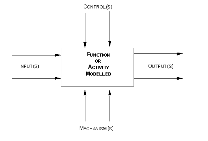

Los Modelos de Procesos IDEF aplicados al conocimiento forman parte de la familia de metodologías IDEF (Integration DEFinition), utilizadas para analizar, diseñar y mejorar procesos organizacionales. Cuando se aplican al conocimiento, permiten identificar cómo se crea, usa, comparte y gestiona la información dentro de una organización.

El modelo IDEF0 en el programa norteamericano del Departamento de Defensa denominado "Integrated Computer-Aided Manufacturing (ICAM)" ha reconocido su utilidad y se le ha estandarizado con el nombre IDEF0 (ICAM Definition Method Zero), pronunciado “eyedeff-zero”. Bajo esta denominación, la metódica SADT se utiliza en cientos de organizaciones relacionadas con la defensa y en industrias de alta tecnología. En 1989 se constituyó una asociación de usuarios denominada IDEF-Users Group (IDEF-UG).

IDEF0 es ampliamente utilizado para describir procesos de negocio, atendiendo a los objetivos centrales, y existen numerosas aplicaciones de software que apoyan su desarrollo. Este modelo guía en la descripción de cada proceso o actividad considerada como la combinación de cinco magnitudes básicas que se representan gráficamente de la siguiente manera:

1) Procesos o actividades. 
2) Inputs (insumos). 
3) Controles. 
4) Mecanismos o recursos para la realización de tareas. 
5) Outputs o resultados conseguidos en el proceso (que podrán ser a su vez inputs o controles de otros procesos).

