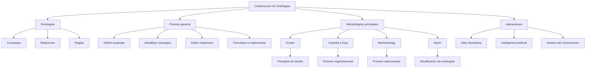

# Ingeniería del Conocimiento (TIC-1015)
## Investigación Individual

### Título de la investigación
   Metodologías de construcción de ontologías

---

### Estudiante
**Nombre completo:**  
Salazar Delgado Angela Sofia

### Docente
Rene Solis Reyes

### Asignatura
Ingeniería del Conocimiento (TIC-1015)

### Institución
Tecnológico Nacional de México

---

## 1. Introducción
Las analogías juegan un papel muy importante en la representación formal de conocimiento. Estas permiten describir conceptos, relaciones y reglas de un dominio especifico de manera estructurada y comprensible tanto para humanos como para sistemas computacionales. La correcta construcción de una ontología requiere el uso de metodologías que guíen el proceso de analisis,diseño, implementación y mantenimiento.

---

## 2. Objetivo
### Objetivo general
Analizar las principales metodologías de construcción de ontologías para comprender su estructura, fases, ventajas y aplicaciones dentro de la ingeniería del conocimiento

---

## 3. Marco teórico
Las ontologías son modelos formales que permiten representar el conocimiento de un dominio mediante conceptos, relaciones y reglas. En la ingeniería del conocimiento, se utilizan para facilitar la interoperabilidad entre sistemas y el razonamiento automático.

Las metodologías de construcción de ontologías surgen como una necesidad para estructurar el proceso de desarrollo, garantizando coherencia, claridad y calidad en el modelo. Entre las más relevantes se encuentran las propuestas por Gruber, Uschold y King, Methontology y NeOn, cada una con distintos niveles de formalidad y complejidad.

---

## 4. Desarrollo
El proceso de construcción de una ontología generalmente incluye: definición del propósito, identificación de conceptos, establecimiento de relaciones, formalización e implementación.

Methontology propone un proceso completo con fases bien definidas, mientras que Uschold y King ofrecen un enfoque más organizacional. La metodología NeOn promueve la reutilización de ontologías existentes, y Gruber se enfoca en principios de diseño como claridad y coherencia.

---

## 5. Análisis y discusión
El estudio de las metodologías de construcción de ontologías permite observar que no existe un modelo único que se adapte a todos los proyectos. Las metodologías más estructuradas, como Methontology y NeOn, ofrecen mayor formalidad, control y calidad en el desarrollo, lo que las hace adecuadas para proyectos complejos o de gran escala. Sin embargo, su aplicación requiere mayor tiempo, recursos y conocimientos especializados.

Por otro lado, metodologías como la de Gruber o Uschold y King presentan enfoques más flexibles y prácticos, lo que facilita su implementación en proyectos pequeños o en entornos organizacionales donde se requiere rapidez en el desarrollo.

En este sentido, la elección de la metodología depende del contexto, los objetivos del proyecto y el nivel de formalización necesario. La tendencia actual apunta hacia la combinación de enfoques estructurados con prácticas ágiles, buscando equilibrio entre calidad, eficiencia y reutilización del conocimiento.

---

## 6. Conclusiones
Las metodologías de construcción de ontologías son esenciales para garantizar la calidad, coherencia y utilidad de los modelos de conocimiento. Cada metodología presenta ventajas y limitaciones, por lo que su elección depende del contexto, el dominio y los recursos disponibles. En proyectos complejos y de gran escala, metodologías como Methontology y NeOn resultan más adecuadas, mientras que enfoques más simples pueden beneficiarse de metodologías menos estructuradas como la de Gruber.

---

## 7. Aporte al repositorio
Explique brevemente:
- Qué aporta esta investigación al repositorio
Esta investigación aporta al repositorio un análisis estructurado y comparativo de las principales metodologías de construcción de ontologías, explicando sus fundamentos, etapas, ventajas y limitaciones. Además, organiza la información de forma clara y académica, lo que facilita la comprensión del tema dentro del área de ingeniería del conocimiento y la Web Semántica. De esta manera, el repositorio se enriquece con un material teórico confiable que puede servir como base para futuros trabajos relacionados con ontologías, inteligencia artificial y representación del conocimiento.
- Cómo puede ser reutilizada por otros estudiantes o cursos futuros
- El contenido puede ser reutilizado como marco teórico para investigaciones posteriores, como guía para desarrollar proyectos prácticos de creación de ontologías o como material de estudio para cursos relacionados con inteligencia artificial, bases de conocimiento o sistemas semánticos. Asimismo, puede servir como referencia para comparar metodologías y seleccionar la más adecuada en proyectos académicos o tecnológicos futuros.

---

## 8. Referencias
Liste las fuentes consultadas en formato académico.  
-   Gruber, T. R. (1993). _A Translation Approach to Portable Ontology Specifications_. Knowledge Acquisition.
    
-   Uschold, M., & King, M. (1995). _Towards a Methodology for Building Ontologies_. Artificial Intelligence Applications Institute.
    
-   Gómez-Pérez, A., Fernández-López, M., & Corcho, O. (2004). _Ontological Engineering_. Springer.
    
-   Suárez-Figueroa, M. C. et al. (2012). _The NeOn Methodology for Ontology Engineering_. Springer

---

## 9. Declaración de originalidad
Declaro que esta investigación es de autoría propia y que las fuentes utilizadas han sido debidamente citadas.

**Firma:**  
Angela Sofia Salazar Delgado

**Fecha:**  
10/02/2026

Metodologías de construcción de ontologías
Una ontología es una especificación explícita y formal de una conceptualización compartida. Esto significa que define de manera clara los conceptos de un dominio, sus propiedades, relaciones y restricciones, permitiendo la interoperabilidad entre sistemas y el razonamiento automático. Las ontologías son ampliamente utilizadas en áreas como la Web Semántica, sistemas expertos, recuperación de información y ciencia de datos.

Importancia de las Metodologías de Construcción de Ontologías

El desarrollo de una ontología sin una metodología adecuada puede generar inconsistencias, ambigüedades y dificultades de mantenimiento. Las metodologías proporcionan:

Un proceso sistemático y organizado.

Lineamientos para identificar conceptos y relaciones.

Mejora en la calidad y reutilización del conocimiento.

Facilitan la validación y evolución de la ontología.

Principales Metodologías de Construcción de Ontologías
Metodología de Gruber

Propuesta por Thomas Gruber, esta metodología se centra en principios de diseño ontológico, tales como claridad, coherencia, extensibilidad, mínimo compromiso ontológico y mínima codificación.

Características principales:

Definición clara del dominio y propósito.

Uso de términos bien definidos.

Enfoque en la reutilización del conocimiento.

Ventajas:

Facilita la interoperabilidad.

Reduce ambigüedades semánticas.

Desventajas:

No define un proceso paso a paso detallado.

Requiere experiencia previa del diseñador.

Metodología de Uschold y King

Esta metodología propone un proceso estructurado para la creación de ontologías empresariales.

Fases:

Identificación del propósito.

Construcción de la ontología.

Evaluación.

Documentación.

Ventajas:

Enfoque claro y organizado.

Adecuada para contextos organizacionales.

Desventajas:

Limitada en el soporte técnico para implementación.

Poca orientación sobre herramientas específicas.

Metodología Methontology

Desarrollada por el grupo de investigación de la Universidad Politécnica de Madrid, es una de las metodologías más completas y utilizadas.

Fases principales:

Especificación.

Conceptualización.

Formalización.

Implementación.

Mantenimiento.

Ventajas:

Proceso detallado y bien documentado.

Permite la validación continua.

Desventajas:

Puede resultar compleja y demandante en tiempo.

Requiere un equipo multidisciplinario.

Metodología NeOn

La metodología NeOn está orientada al desarrollo de redes de ontologías y la reutilización de conocimiento existente.

Características:

Uso de ontologías previamente creadas.

Soporte para ontologías distribuidas.

Enfoque colaborativo.

Ventajas:

Reduce costos y tiempo de desarrollo.

Favorece la interoperabilidad.

Desventajas:

Mayor complejidad en la integración.

Dependencia de ontologías externas.
Aplicaciones de las Ontologías

Las ontologías se aplican en diversos campos como:

Web Semántica.

Sistemas de recomendación.

Inteligencia artificial.

Gestión del conocimiento.

Educación y e-learning.

Ciencias de la salud.

